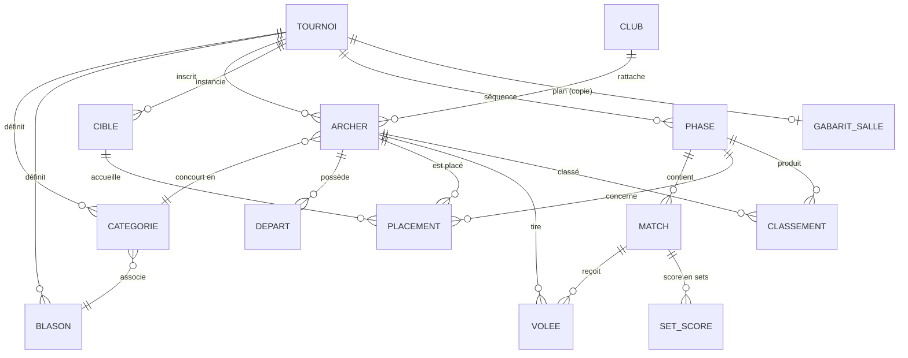

# Modèle de données détaillé — Kervignarc

- **Version** : 0.1
- **Date** : 2026-07-08
- **Base** : SQLite (WAL), ORM SQLAlchemy, migrations Alembic (ADR-0002, ADR-0005)
- **Source** : dérive du CDC technique §5 ; termes selon `glossaire.md`.

> Les entités du **domaine** restent pures ; ce schéma décrit la **persistance** (adapters). Les DTO d'API sont distincts (ADR-0007). Types indicatifs SQLite (`INTEGER`, `TEXT`, `REAL`, `BOOLEAN`, `TEXT`(ISO-8601) pour les dates, `TEXT`(JSON) pour les configs).

## Vue d'ensemble (relations)



---

## Entités

### TOURNOI
| Champ | Type | Contraintes |
|---|---|---|
| id | INTEGER | PK |
| nom | TEXT | NOT NULL |
| date | TEXT (date) | NOT NULL |
| lieu | TEXT | |
| type_tournoi | TEXT | `officiel` \| `non_officiel` |
| statut | TEXT | `brouillon` \| `en_cours` \| `termine` |
| tarif_depart | REAL | ≥ 0 |
| created_at | TEXT (datetime) | |

> Le plan de salle d'un tournoi n'est **pas** une FK sur `TOURNOI` : c'est une **copie** rangée
> dans `GABARIT_SALLE` et pointant vers le tournoi (`GABARIT_SALLE.tournoi_id`), pour pouvoir
> l'ajuster sans altérer le modèle réutilisable (E01US008). Un tournoi a au plus une telle copie.

### CLUB
| id | INTEGER | PK |
| nom | TEXT | NOT NULL, UNIQUE |

### CATEGORIE
| id | INTEGER | PK |
| tournoi_id | INTEGER | FK → TOURNOI, NOT NULL |
| libelle | TEXT | NOT NULL |
| arme | TEXT | ex. `classique`/`poulie`/`nu` |
| tranche_age | TEXT | |
| sexe | TEXT | `H`\|`F`\|`mixte` |
| blason_id | INTEGER | FK → BLASON (défaut) |

### BLASON
| id | INTEGER | PK |
| tournoi_id | INTEGER | FK → TOURNOI |
| nom | TEXT | NOT NULL |
| taille | REAL | fraction de place (0 < taille ≤ 1) |
| capacite | INTEGER | ≥ 1 |

### ARCHER
| id | INTEGER | PK |
| tournoi_id | INTEGER | FK → TOURNOI, NOT NULL |
| nom | TEXT | NOT NULL |
| prenom | TEXT | NOT NULL |
| club_id | INTEGER | FK → CLUB |
| categorie_id | INTEGER | FK → CATEGORIE |
| _index_ | | UNIQUE(tournoi_id, nom, prenom, club_id) pour dédoublonnage |

### DEPART
| id | INTEGER | PK |
| archer_id | INTEGER | FK → ARCHER, NOT NULL |
| numero | INTEGER | n° de départ |
| tarif | REAL | copie du tarif appliqué |
| montant_du | REAL | = tarif |
| paye | BOOLEAN | défaut `false` |

### GABARIT_SALLE
| id | INTEGER | PK |
| nom | TEXT | NOT NULL |
| nb_cibles | INTEGER | ≥ 1 |
| config | TEXT (JSON) | capacités et positions par cible |
| tournoi_id | INTEGER | FK → TOURNOI ; `NULL` = **modèle** réutilisable, renseigné = **copie** appliquée à un tournoi (E01US008) |

### CIBLE
| id | INTEGER | PK |
| tournoi_id | INTEGER | FK → TOURNOI |
| index_cible | INTEGER | n° de cible |
| capacite | INTEGER | 1 / 2 / 4 |

### PLACEMENT
| id | INTEGER | PK |
| tournoi_id | INTEGER | FK → TOURNOI |
| phase_id | INTEGER | FK → PHASE (null = qualif générale) |
| archer_id | INTEGER | FK → ARCHER |
| depart_id | INTEGER | FK → DEPART |
| cible_id | INTEGER | FK → CIBLE |
| position | TEXT | `A`\|`B`\|`C`\|`D` |
| _contrainte_ | | UNIQUE(phase_id, cible_id, position) |

### PHASE
| id | INTEGER | PK |
| tournoi_id | INTEGER | FK → TOURNOI, NOT NULL |
| ordre | INTEGER | position dans la séquence |
| type | TEXT | `qualification`\|`barrage`\|`tableau`\|`placement`\|`finale`\|`big_shoot_off` |
| config | TEXT (JSON) | **politiques** + paramètres (voir §Config phase) |
| statut | TEXT | `a_venir`\|`en_cours`\|`terminee` |

### MATCH
| id | INTEGER | PK |
| phase_id | INTEGER | FK → PHASE, NOT NULL |
| numero | TEXT | ex. `M161` |
| tour | INTEGER | n° de tour |
| source_a | TEXT (JSON) | origine participant A (seed / gagnant M / perdant M / rang) |
| source_b | TEXT (JSON) | origine participant B |
| archer_a_id | INTEGER | FK → ARCHER (résolu) |
| archer_b_id | INTEGER | FK → ARCHER (résolu) |
| vainqueur_id | INTEGER | FK → ARCHER |
| statut | TEXT | `a_jouer`\|`en_cours`\|`termine`\|`bye`\|`forfait` |

### VOLEE
| id | INTEGER | PK |
| match_id | INTEGER | FK → MATCH (null si qualif) |
| phase_id | INTEGER | FK → PHASE |
| archer_id | INTEGER | FK → ARCHER, NOT NULL |
| index_volee | INTEGER | n° de volée |
| fleches | TEXT (JSON) | ex. `["10","9","M"]` |
| total | INTEGER | somme calculée |
| valide | BOOLEAN | verrou après validation |
| auteur | TEXT | scoreur (session) |
| horodatage | TEXT (datetime) | |
| saisie_uid | TEXT | idempotence (rejeu file/offline) |

### SET_SCORE (duels)
| id | INTEGER | PK |
| match_id | INTEGER | FK → MATCH, NOT NULL |
| archer_id | INTEGER | FK → ARCHER |
| index_set | INTEGER | n° de set |
| points_set | INTEGER | points de set attribués |

### CLASSEMENT
| id | INTEGER | PK |
| phase_id | INTEGER | FK → PHASE |
| archer_id | INTEGER | FK → ARCHER |
| rang | INTEGER | position |
| contexte | TEXT | `qualification`\|`phase`\|`final_1_n` |

### UTILISATEUR / SESSION
| id | INTEGER | PK |
| role | TEXT | `admin`\|`scoreur`\|`public` |
| secret | TEXT | hash mot de passe (admin) |
| cibles | TEXT (JSON) | cibles habilitées (scoreur, multi-cibles) |
| jeton | TEXT | jeton de session |
| expire_at | TEXT (datetime) | |

### AUDIT_LOG
| id | INTEGER | PK |
| acteur | TEXT | rôle / session |
| action | TEXT | ex. `correction_score`, `validation`, `forfait` |
| entite | TEXT | ex. `Volee#123` |
| avant | TEXT (JSON) | état précédent |
| apres | TEXT (JSON) | nouvel état |
| horodatage | TEXT (datetime) | |

---

## Config d'une PHASE (champ `config` JSON)

Portée : les **politiques injectables** (ADR-0004) et leurs paramètres. Exemple pour un tableau à placement intégral :

```json
{
  "sourcing": { "type": "tous_inscrits" },
  "policies": {
    "routing":  "cascade",
    "scoring":  "sets_4pts",
    "seeding":  "serpent",
    "byes":     "mieux_classes",
    "tiebreak": "shoot_off_centre",
    "depth":    "1_a_n"
  },
  "params": { "taille_tableau": 128 }
}
```

Autres valeurs de `routing` : `elimination_seche` (MVP, podium), `repechage` (World Archery, J4).
Autres `depth` : `top_n` (avec `params.n`).

---

## Enums de référence

| Enum | Valeurs |
|---|---|
| `type_tournoi` | officiel, non_officiel |
| `statut_tournoi` | brouillon, en_cours, termine |
| `type_phase` | qualification, barrage, tableau, placement, finale, big_shoot_off |
| `routing` | elimination_seche, cascade, repechage |
| `depth` | 1_a_n, top_n |
| `statut_match` | a_jouer, en_cours, termine, bye, forfait |
| `role` | admin, scoreur, public |
| `valeur_fleche` | 0-10, X, M |

---

## Notes d'implémentation
- **Écritures** exclusivement via la file (writer unique, ADR-0005) ; les colonnes `valide`/`vainqueur_id` ne changent que dans une transaction courte.
- **Idempotence** : `VOLEE.saisie_uid` évite les doublons au rejeu (offline/reconnexion, E04US010).
- **Intégrité placement** : contrainte d'unicité `(phase_id, cible_id, position)`.
- **Config en JSON** : souplesse du moteur configurable ; les données volumineuses (matchs, volées) restent relationnelles.
- À valider en conception détaillée : indexation (FK, `tournoi_id`), stratégie de cascade de suppression, stockage des flèches (JSON vs table dédiée `FLECHE`).
