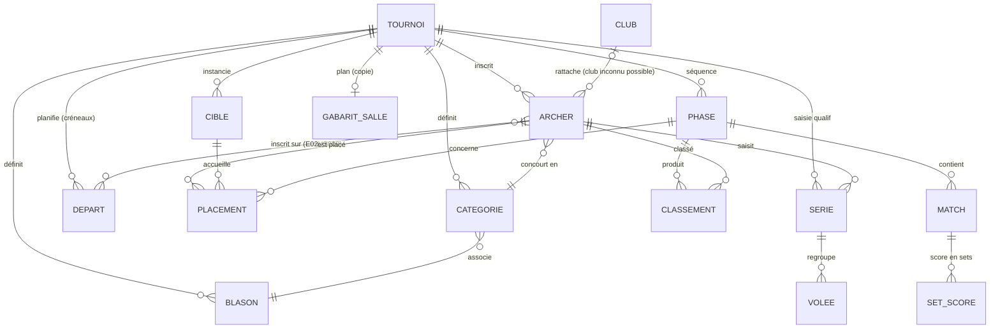

# Modèle de données détaillé — Kervignarc

- **Version** : 0.5
- **Date** : 2026-07-16 *(v0.5 : table de liaison `INSCRIPTION` (archer ↔ départ, portant `paye`) — E02US009, [ADR-0017](adr/0017-le-depart-est-un-creneau-du-tournoi.md) ; montant dû **dérivé** du tarif du départ, non stocké)*
- *v0.4 : 2026-07-16 — `DEPART` devient un **créneau du tournoi** (`tournoi_id`, `horaire`, `tarif_centimes` obligatoire), le tarif **quitte** `TOURNOI` — [ADR-0017](adr/0017-le-depart-est-un-creneau-du-tournoi.md), E02US004 ; le lien archer↔départ + `paye` passent à E02US009*
- *v0.3 : 2026-07-15 — `ARCHER.club_id` **nullable** = club *inconnu* et index UNIQUE de dédoublonnage **abandonné** ([ADR-0014](adr/0014-club-inconnu-plutot-que-club-sentinelle.md), [ADR-0015](adr/0015-signaler-un-doublon-plutot-que-l-interdire.md)) ; `ARCHER.categorie_id` NOT NULL*
- *v0.2 : 2026-07-14 — cadrage FFTA (`CATEGORIE.ages`, `BLASON.zones`, capacité de cible non bornée, barème par arme, blason surchargé par phase)*
- **Base** : SQLite (WAL), ORM SQLAlchemy, migrations Alembic (ADR-0002, ADR-0005)
- **Source** : dérive du CDC technique §5 ; termes selon `glossaire.md` ; règles métier selon [`referentiel-ffta.md`](referentiel-ffta.md).

> Les entités du **domaine** restent pures ; ce schéma décrit la **persistance** (adapters). Les DTO d'API sont distincts (ADR-0007). Types indicatifs SQLite (`INTEGER`, `TEXT`, `REAL`, `BOOLEAN`, `TEXT`(ISO-8601) pour les dates, `TEXT`(JSON) pour les configs).

## Vue d'ensemble (relations)



---

## Entités

### TOURNOI
| Champ | Type | Contraintes |
|---|---|---|
| id | INTEGER | PK |
| nom | TEXT | NOT NULL |
| date | TEXT (date) | NOT NULL |
| lieu | TEXT | |
| type_tournoi | TEXT | `officiel` \| `non_officiel` |
| statut | TEXT | `brouillon` \| `prêt` \| `en_cours` \| `en_pause` \| `termine` \| `archive` \| `annule` — **7 statuts** ([ADR-0026](adr/0026-cycle-de-vie-du-tournoi-sept-statuts.md), E01US017) |
| created_at | TEXT (datetime) | |

> **Le tarif n'est plus au tournoi** ([ADR-0017](adr/0017-le-depart-est-un-creneau-du-tournoi.md),
> E02US004) : `tarif_depart_centimes` a été **retiré** de `TOURNOI` (migration `0016`) et vit
> désormais sur `DEPART` — un tournoi peut se jouer sur plusieurs créneaux à prix différents.

> Le plan de salle d'un tournoi n'est **pas** une FK sur `TOURNOI` : c'est une **copie** rangée
> dans `GABARIT_SALLE` et pointant vers le tournoi (`GABARIT_SALLE.tournoi_id`), pour pouvoir
> l'ajuster sans altérer le modèle réutilisable (E01US008). Un tournoi a au plus une telle copie.

### CLUB
| id | INTEGER | PK |
| nom | TEXT | NOT NULL, UNIQUE |

> **Référentiel global (E02US001).** Seule table **sans** `tournoi_id` : les clubs sont réutilisés
> d'une compétition à l'autre. Elle n'appartient donc pas à la descendance de `TOURNOI` — supprimer
> un tournoi ne touche pas aux clubs, et [DETTE-001](dette.md) ne la concerne pas.
>
> **`UNIQUE` = garde-fou d'intégrité, pas la règle fonctionnelle.** La contrainte SQL est **exacte**
> (elle n'attrape que les homonymes au caractère près). Le refus présenté à l'utilisateur est plus
> large : `ServiceClubs` compare les noms au sens de `domain.club.cle_nom` — espaces de bord, casse
> **et accents** repliés, donc « Élan de Fougères » ≡ « elan de fougeres ». Un référentiel dont
> l'intérêt est de ne pas ressaisir ne doit pas offrir deux entrées pour un même club : les archers
> s'y répartiraient et les listes par club (EPIC-09) seraient fausses. `cle_nom` sert aussi de clé
> de **tri** à l'écran (sans elle, un tri par code point classerait « Élan » après « Zénith »).

### CATEGORIE
| id | INTEGER | PK |
| tournoi_id | INTEGER | FK → TOURNOI, NOT NULL |
| libelle | TEXT | NOT NULL — ex. « Arc Nu U18 Homme » |
| arme | TEXT | ex. `classique`/`poulie`/`nu` |
| ages | TEXT (JSON) | **une ou plusieurs** tranches — ex. `["U15","U18"]` |
| sexe | TEXT | `H`\|`F`\|`mixte` |
| blason_id | INTEGER | FK → BLASON (défaut) |
| hauteur_cm | INTEGER | NOT NULL — hauteur du centre de l'or, cm (130 défaut, 110 U11) |

> ⚠️ **Une catégorie n'est pas le triplet `arme × âge × sexe`** — c'est une **entité nommée** portant une
> **règle d'éligibilité** (CDC fonctionnel EF-1.2). La FFTA regroupe des tranches d'âge : en arc nu,
> la catégorie « U18 » couvre **U15 et U18**, et « Scratch » couvre **U21, S1, S2, S3**
> ([référentiel §3](referentiel-ffta.md)). Une colonne `tranche_age` scalaire rend ces cas
> indistinguables — le même libellé « U18 » désignerait une tranche en classique et deux en arc nu.
> D'où `ages` (liste). Invariant à tenir : au sein d'un tournoi, un archer donné (arme, âge, sexe)
> ne doit être éligible qu'à **une seule** catégorie.

### BLASON
| id | INTEGER | PK |
| tournoi_id | INTEGER | FK → TOURNOI |
| nom | TEXT | NOT NULL |
| taille | REAL | fraction de place (0 < taille ≤ 1) |
| capacite | INTEGER | ≥ 1 |
| zones | TEXT (JSON) | valeurs de score admises — ex. `["10","9","8","7","6","M"]` |

> **`zones`** — Les valeurs tirables dépendent du **blason**, pas du barème de la phase : un
> **triple 40 n'a pas les zones 5 → 1** (son minimum est le bleu clair = 6, [référentiel §4.4](referentiel-ffta.md)),
> et le « 10 intérieur » des poulies est un cercle plus petit que le 10 classique (§4.3). C'est
> `zones` qui pilote le pavé de saisie de la tablette (EF-5.2).
>
> *Livré en E01US014* (migration `0019`, [ADR-0020](adr/0020-blason-zones-vocabulaire-ferme-et-defaut-sur-ensemble.md)).
> Vocabulaire fermé à `10`→`1` et `M` (§4.2), porté par l'énuméré `ZoneScore` et validé **à la
> frontière** (400), comme `TrancheAge` pour `ages` (ADR-0019). Les règles **structurelles** restent
> au domaine (422) : `M` toujours présent, au moins une zone marquante, pas de doublon, ordre
> canonique normalisé. Un jeu **non contigu** est admis — la contiguïté ne sert aucun consommateur,
> et RG-8 interdit d'imposer le règlement. Le « 10 intérieur » **n'ajoute pas de valeur** (c'est une
> géométrie, le score reste 10) et la **mouche (X)** n'est pas une zone.
>
> **Défaut = `["10",…,"1","M"]`** (blason simple complet), y compris pour le backfill des lignes
> existantes : `taille` étant une *fraction de place* et non un diamètre, rien ne distingue un
> triple d'un blason simple. ⚠️ **Les triples antérieurs à `0019` sont à corriger à la main** —
> EPIC-04 ne doit pas supposer `zones` fiable sur une donnée antérieure à cette migration.
>
> **La hauteur du centre vit sur `CATEGORIE`, pas sur le blason** (`CATEGORIE.hauteur_cm` : 110 cm
> pour les U11, 130 cm sinon, §5). Elle interdit à un U11 de partager une butte avec des adultes et
> n'est **pas** réductible à `taille` : le placement en fait une contrainte de 1er rang (une butte,
> une hauteur). *Résorbe [DETTE-002](dette.md) en E03US001* ([ADR-0022](adr/0022-hauteur-de-centre-sur-la-categorie.md),
> migration `0020`) — l'option « hauteur sur le blason » a été écartée : la hauteur suit la catégorie
> d'âge de l'archer, pas le carton.

### ARCHER
| id | INTEGER | PK |
| tournoi_id | INTEGER | FK → TOURNOI, NOT NULL |
| nom | TEXT | NOT NULL |
| prenom | TEXT | NOT NULL |
| club_id | INTEGER | FK → CLUB, **nullable** — `NULL` = club *inconnu*, jamais « aucun club » ([ADR-0014](adr/0014-club-inconnu-plutot-que-club-sentinelle.md)) |
| categorie_id | INTEGER | FK → CATEGORIE, **NOT NULL** |
| cible | INTEGER | **nullable** — placement **provisoire** du walking skeleton (E00US011) : un simple numéro, sans capacité ni contrainte de blason. Remplacé par `PLACEMENT` en EPIC-03. `NOT NULL` ⇒ archer *placé*, ce qui suspend sa suppression ([ADR-0016](adr/0016-supprimer-un-archer-engage-plutot-que-le-refuser.md)) |

> **`club_id` posé par E02US001** (migration `0014`) ; `prenom` et `categorie_id` par E02US002
> (migration `0015`). Le rattachement au club est arrivé avec le **référentiel** plutôt qu'avec
> l'inscription complète parce qu'il est ce qui rend le CA « un club utilisé n'est pas supprimable »
> **exerçable** : sans lui, le refus (`ClubReference` → 409) n'aurait été qu'un garde-fou qu'aucun
> chemin réel ne déclenche.
>
> **`club_id` reste nullable, `categorie_id` ne l'est pas** — asymétrie décidée en
> [ADR-0014](adr/0014-club-inconnu-plutot-que-club-sentinelle.md) : le club est une donnée
> administrative externe qu'on ignore parfois au guichet (mais que la FFTA impose : le `NULL` est
> une **anomalie à résorber**, signalée à l'écran et comptée par E12US005), là où la catégorie se lit
> sur l'archer présent et commande classement, placement et facturation. **Aucun club « Sans club »
> ne doit être introduit** pour combler les `NULL` : deux archers y porteraient le même `club_id` et
> le placement (E03US006, RG-3) les croirait du même club — voir l'ADR.
>
> **Pas d'index UNIQUE de dédoublonnage** (le modèle v0.2 prévoyait
> `UNIQUE(tournoi_id, nom, prenom, club_id)`) : il rejetterait un père et son fils, homonymes du
> même club. Le doublon probable est **signalé** par le service (409 `homonyme_archer`, au sens de
> `domain.archer.cle_identite`) et l'admin confirme — [ADR-0015](adr/0015-signaler-un-doublon-plutot-que-l-interdire.md).
> Le contrôle applicatif suffit : le **writer unique** sérialise les écritures, et le contrôle comme
> l'insertion tiennent dans la même commande en file. La détection fine et la fusion sont à
> **E02US005**.
>
> `club_id` est **hors du périmètre de [DETTE-001](dette.md)**, à la différence des autres FK
> d'`ARCHER` (`tournoi_id`, `categorie_id`) : elle pointe vers `CLUB`, qui n'est pas dans la
> descendance de `TOURNOI`. Supprimer un tournoi (donc ses archers) ne la viole jamais — c'est le
> sens inverse qu'elle contraint, et ce cas-là est **tranché** par le service, comme l'est déjà
> `CATEGORIE.blason_id`.

### DEPART
| Champ | Type | Contraintes |
|---|---|---|
| id | INTEGER | PK |
| tournoi_id | INTEGER | FK → TOURNOI, NOT NULL |
| numero | INTEGER | n° de créneau, **attribué par le système** ; `UNIQUE(tournoi_id, numero)` |
| horaire | TEXT | libellé de créneau (ex. « 9h00 »), NULL admis |
| tarif_centimes | INTEGER | **NOT NULL**, ≥ 0 — prix du créneau en **centimes** (`0` = gratuit) |
| quota | INTEGER | **NULL admis** = sans plafond ; sinon nombre max d'inscrits, `1 ≤ quota ≤ 1 000` (E02US006). Invariant **applicatif** (`DepartComplet`, règle 7) : aucune contrainte SQL ne l'exprime — le dépassement est refusé par le service, sérialisé par le writer unique |

> **Le départ est un créneau du tournoi** ([ADR-0017](adr/0017-le-depart-est-un-creneau-du-tournoi.md),
> E02US004), partagé par les archers qui s'y inscrivent — il n'appartient **pas** à un archer. Le lien
> **archer ↔ départ** (inscription, portant `paye` ; montant dû **dérivé** du `tarif_centimes` du
> départ) est la table de liaison d'**E02US009**, pas de cette US — c'est là que reviennent les
> colonnes `montant_du`/`paye` que la v0.3 posait à tort ici.
> **Centimes entiers** ([ADR-0012](adr/0012-argent-en-centimes-entiers.md)) : c'est sur `tarif_centimes`
> que porteront les **sommes** d'EPIC-08/09 (montant par archer = somme des tarifs de ses départs), là
> où un REAL dériverait. Le tarif est **obligatoire** : l'état « non défini » qu'avait le tarif du
> tournoi disparaît (on ne crée pas un créneau sans prix) ; `0` = gratuit reste distinct. FK
> `depart → tournoi` **sans `ON DELETE`** → [DETTE-001](dette.md).

### INSCRIPTION
| Champ | Type | Contraintes |
|---|---|---|
| id | INTEGER | PK |
| archer_id | INTEGER | FK → ARCHER, NOT NULL |
| depart_id | INTEGER | FK → DEPART, NOT NULL |
| paye | BOOLEAN | NOT NULL, défaut `false` |

> **Table de liaison archer ↔ départ** (E02US009, [ADR-0017](adr/0017-le-depart-est-un-creneau-du-tournoi.md)) :
> l'inscription d'un archer sur un **créneau** du tournoi. `UNIQUE(archer_id, depart_id)` — un archer ne
> s'inscrit **qu'une fois** sur un même départ (une seconde tentative est un `DejaInscrit`, 409, pas un
> doublon toléré comme l'homonyme). L'invariant « archer et départ du **même tournoi** » est tenu par le
> **service** (l'entité `Inscription` ne porte que les deux clés) : un départ d'un autre tournoi est
> *introuvable* du point de vue de l'archer.
> **Le montant dû n'est pas une colonne** : il se **dérive** du `tarif_centimes` du départ à la lecture
> (rien à recopier, rien à resynchroniser). C'est l'erreur que la v0.3 faisait en posant
> `montant_du_centimes`/`paye` sur `DEPART` ; seul `paye` — un **fait** propre à l'inscription, non
> dérivable — vit ici. Les **sommes** d'EPIC-08 (montant par archer = somme des tarifs de ses départs)
> se calculent par jointure `INSCRIPTION → DEPART`.
> **Deux FK sans `ON DELETE`** (`archer_id`, `depart_id`) → [DETTE-001](dette.md) : la suppression
> d'un archer (E02US003) **et** celle d'un départ (E02US009) purgent les inscriptions par **cascade
> applicative** dans la transaction de l'adapter, jamais par `ON DELETE CASCADE` en base.

### GABARIT_SALLE
| id | INTEGER | PK |
| nom | TEXT | NOT NULL |
| nb_cibles | INTEGER | ≥ 1 |
| config | TEXT (JSON) | capacités et positions par cible |
| tournoi_id | INTEGER | FK → TOURNOI ; `NULL` = **modèle** réutilisable, renseigné = **copie** appliquée à un tournoi (E01US008) |

### CIBLE
| id | INTEGER | PK |
| tournoi_id | INTEGER | FK → TOURNOI |
| index_cible | INTEGER | n° de cible |
| capacite | INTEGER | ≥ 1 — usuellement 1 / 2 / 4, **non borné** (la FFTA décrit aussi 3 triples verticaux, §5) |

### PLACEMENT
Table du **plan de cibles matérialisé** livrée par E03US004
([ADR-0024](adr/0024-plan-de-cibles-materialise-ajustable.md)) — une **affectation par inscription**
(VO domaine `Affectation`) : l'unité persistée du plan d'un départ, ajustable au glisser-déposer. Un
inscrit **sans** ligne est en **réserve**.

| inscription_id | INTEGER | **PK**, FK → INSCRIPTION, **ON DELETE CASCADE** |
| depart_id | INTEGER | FK → DEPART, **ON DELETE CASCADE** ; dénormalisé (lit/réécrit le plan d'un départ sans jointure) |
| cible_index | INTEGER | rang de la cible dans le gabarit (1-based) |
| position | TEXT | `A`\|`B`\|`C`\|`D`\|`E`… — lettres, **non bornées à D** (capacité de cible non bornée, cf. `CIBLE` ; le **code** plafonne encore à 4 → [DETTE-010](dette.md), résorption E01US019) |

> **`ON DELETE CASCADE` assumé** (à rebours de DETTE-001) : donnée **dérivée, reconstructible et
> feuille** — l'auto la régénère, sa disparition suit celle de l'inscription/du départ (ADR-0024).
>
> **Cible par `cible_index`, pas FK → CIBLE** : le gabarit (E01US008) porte ses cibles/capacités en
> JSON (la table `CIBLE` ci-dessus reste un **modèle non encore matérialisé**) ; l'index 1-based du
> gabarit suffit à désigner la butte.
>
> **Généralisation phase (EPIC-05, future).** Quand le **placement** deviendra une **phase**
> (ADR-0004), cette table s'étendra vers le modèle générique d'origine : `phase_id` (`null` = qualif),
> clé par archer, `cible_id` FK → CIBLE, `UNIQUE(phase_id, cible_id, position)`. E03US004 en livre la
> **première incarnation** (qualification, clé inscription) ; l'évolution **enrichit la même table**
> plutôt que d'en créer une seconde homonyme.

### PHASE
| id | INTEGER | PK |
| tournoi_id | INTEGER | FK → TOURNOI, NOT NULL |
| ordre | INTEGER | position dans la séquence |
| type | TEXT | `qualification`\|`barrage`\|`tableau`\|`placement`\|`finale`\|`big_shoot_off` |
| config | TEXT (JSON) | **politiques** + paramètres (voir §Config phase) |
| statut | TEXT | `a_venir`\|`en_cours`\|`en_pause`\|`terminee` — `en_pause` **gèle la phase** ([ADR-0026](adr/0026-cycle-de-vie-du-tournoi-sept-statuts.md) §3, distinct du `en_pause` du tournoi) |

> **Introduction minimale (E01US009 / [ADR-0011](adr/0011-phase-qualification-anticipee.md)).** La
> table est créée dès J1 pour héberger le **barème de qualification** dans `config.scoring`
> (`{"volees": N, "fleches": M, "mode": "cumul"}`) — une seule phase `qualification` par tournoi.
> `ordre` et `statut` sont conformes à ce schéma mais **non exploités** avant le moteur (EPIC-05,
> ADR-0004), qui ajoutera les autres politiques dans `config` et les autres types/transitions.
>
> **Grain de validation (E01US015, `D-11`).** Deuxième politique de la même phase, dans
> `config.validation` (`{"grain": …}`, + `"n_volees": N` pour `toutes_les_n_volees`) — **sans
> migration**, comme l'annonçait l'ADR-0011. Une phase écrite avant E01US015 n'a pas cette clé :
> elle se relit avec le **preset de son type** (`qualification` → `fin_de_serie`), et se complète à
> la première écriture. Le grain doit être **admis par le type de phase** (pas de `fin_de_duel` sur
> une qualification) et sa cadence **ne peut pas dépasser** `config.scoring.volees` — sinon aucune
> validation n'aurait lieu ; les deux politiques sont donc **cohérentes par construction**.

### MATCH
| id | INTEGER | PK |
| phase_id | INTEGER | FK → PHASE, NOT NULL |
| numero | TEXT | ex. `M161` |
| tour | INTEGER | n° de tour |
| source_a | TEXT (JSON) | origine participant A (seed / gagnant M / perdant M / rang) |
| source_b | TEXT (JSON) | origine participant B |
| archer_a_id | INTEGER | FK → ARCHER (résolu) |
| archer_b_id | INTEGER | FK → ARCHER (résolu) |
| vainqueur_id | INTEGER | FK → ARCHER |
| statut | TEXT | `a_jouer`\|`en_cours`\|`termine`\|`bye`\|`forfait` |

> **Équipes** — hors périmètre (CDC fonctionnel §2.2), mais la **porte reste ouverte** : un match
> oppose conceptuellement des **participants**, pas nécessairement des archers individuels
> ([référentiel §6.3](referentiel-ffta.md) : équipes de 3). Si les équipes entrent au périmètre,
> `archer_a_id`/`archer_b_id` devront devenir `participant_a`/`participant_b` — à trancher **avant**
> d'écrire le moteur (EPIC-05), pas après.

### SERIE (E04US002)
| id | INTEGER | PK |
| tournoi_id | INTEGER | FK → TOURNOI, NOT NULL (DETTE-001) |
| archer_id | INTEGER | FK → ARCHER, NOT NULL (DETTE-001) |
| — | — | **UNIQUE(tournoi_id, archer_id)** — une série de qualification par archer |

> Racine de l'agrégat de **saisie de qualification** (`Serie`, tranche persistance PR2a — la couture
> d'atomicité acte↔trace est [ADR-0035](adr/0035-atomicite-acte-trace-session-partagee.md)) : la
> grille d'un archer. Le **cumul n'est pas stocké** — il se recalcule des volées validées
> (`Serie.cumul`) ; seul l'état saisi est persisté. Les volées vivent dans la table enfant `VOLEE`
> (`serie_id`). Deux FK **sans `ON DELETE`** = **DETTE-001** (donnée saisie de la descendance du
> tournoi ; la cascade `archer → serie` est **applicative**, `ArcherRepositorySQL.supprimer`).

### VOLEE (E04US002)
| id | INTEGER | PK |
| serie_id | INTEGER | FK → SERIE, NOT NULL, **ON DELETE CASCADE** |
| numero | INTEGER | rang de la volée dans le barème (`1..N`) |
| valeurs | TEXT (JSON) | zones de score, ex. `["10","9","M"]` |
| saisie_par | TEXT | marqueur déclaratif de saisie, nullable |
| validee_par | TEXT | scoreur ; **non NULL = verrou** (volée validée), nullable |
| — | — | **UNIQUE(serie_id, numero)** — un seul rang N par série |

> Table **enfant** de `SERIE` (composant strict de l'agrégat). Le verrou n'est **pas** une colonne
> dédiée : `validee_par` non NULL **est** le verrou. Le total n'est pas stocké (cumul recalculé).
> `serie_id` en **`ON DELETE CASCADE`** — **hors** DETTE-001, comme `PLACEMENT` (feuille auto-cascadée).
>
> **Colonnes des tranches suivantes** (non encore livrées) : `horodatage` (le « quand » d'une
> saisie, métadonnée du chemin de lecture — PR2b) ; `saisie_uid` (idempotence au rejeu offline —
> E04US009). La **saisie en duels** (rattachement à un `MATCH`) sera modélisée avec **E04US013** ;
> aujourd'hui `VOLEE` ne couvre que la **qualification** (via `SERIE`).

### SET_SCORE (duels)
| id | INTEGER | PK |
| match_id | INTEGER | FK → MATCH, NOT NULL |
| archer_id | INTEGER | FK → ARCHER |
| index_set | INTEGER | n° de set |
| points_set | INTEGER | points de set attribués |

### CLASSEMENT
| id | INTEGER | PK |
| phase_id | INTEGER | FK → PHASE |
| archer_id | INTEGER | FK → ARCHER |
| rang | INTEGER | position |
| contexte | TEXT | `qualification`\|`phase`\|`final_1_n` |

### SCOREUR (E10US003)
| id | INTEGER | PK |
| tournoi_id | INTEGER | FK → TOURNOI, NOT NULL (DETTE-001) |
| nom | TEXT | NOT NULL |
| code | TEXT | NOT NULL, **UNIQUE global** (login par code seul) |

> Table **livrée** par E10US003. Le scoreur est une **personne** du tournoi, identifiée par un
> **code individuel** ; il est **itinérant** (aucune cible rattachée) et **valide** les scores
> (`D-12`/`D-13`). Voir [ADR-0025](adr/0025-mode-d-identite-scoreur-par-code-individuel.md).

### POSTE (E04US001)
| id | INTEGER | PK |
| tournoi_id | INTEGER | FK → TOURNOI, NOT NULL (DETTE-001) |
| cible_index | INTEGER | NOT NULL (rang 1-based de la cible dans le plan de salle) |
| code | TEXT | NOT NULL, **UNIQUE global** (rattachement par code seul) |

> `UNIQUE(tournoi_id, cible_index)` : **une seule cible N par tournoi**. Table **livrée** par
> E04US001. Le poste est le **credential d'une cible** — identité = le **lieu** (`D-13`, 3ᵉ mode
> après le scoreur) : une tablette s'y **rattache** par le code (imprimé sous le QR de la cible,
> E09US008), et reçoit un **jeton de poste** opaque en **mémoire** (`PosteSessionStore`, sans
> expiration, persisté côté client), **lié au tournoi** et invalidé à sa clôture. La régénération des
> codes est E09US008. Voir [ADR-0029](adr/0029-mode-d-identite-poste-de-cible-et-jeton-de-poste.md).

### ~~UTILISATEUR / SESSION~~ — **modèle prospectif abandonné** (E10US002/E10US003)
> ⚠️ Ce modèle unifié à trois rôles (`admin`/`scoreur`/`public`) et sessions persistées **n'a pas
> été retenu** — la refonte `D-13` (14/07/2026) a remplacé les rôles par **trois modes d'identité
> proportionnés au risque**, dont aucun n'est un compte utilisateur :
> - **admin** : login + mot de passe dans un fichier `.env` (aucune entité, aucune table — ADR-0009) ;
> - **scoreur** : table `scoreur` ci-dessus + **session en mémoire** (jeton opaque nominatif,
>   `ScoreurSessionStore`, **sans expiration** ni `expire_at`, non persistée — ADR-0025) ;
> - **poste de cible** : identité = le **lieu** ; table `poste` ci-dessus + **session en mémoire**
>   (jeton de poste opaque, `PosteSessionStore`, lié au tournoi, non persistée côté serveur —
>   E04US001, ADR-0029). La garde « le poste ne saisit que pour SA cible » est E10US007.
>
> Il n'y a donc **ni table `UTILISATEUR`, ni table `SESSION`, ni colonne `cibles`/`expire_at`** : le
> `role`, le `secret`, les cibles habilitées et l'expiration décrits ici sont caducs. Bloc conservé
> comme trace de conception (cf. la même mise en garde « cible vs implémentation » que DETTE-003).

| id | INTEGER | ~~PK~~ (caduc) |
| role | TEXT | ~~`admin`\|`scoreur`\|`public`~~ (caduc — trois modes d'identité, `D-13`) |
| secret | TEXT | ~~hash mot de passe (admin)~~ (admin = `.env`, ADR-0009) |
| cibles | TEXT (JSON) | ~~cibles habilitées~~ (caduc — scoreur **itinérant**, `D-12`) |
| jeton | TEXT | ~~jeton de session~~ (en **mémoire**, non persisté) |
| expire_at | TEXT (datetime) | ~~expiration~~ (caduc — **sans expiration**, ADR-0025) |

### AUDIT_LOG (E10US005) — table `entree_audit`
| id | INTEGER | PK |
| tournoi_id | INTEGER | FK → TOURNOI, NOT NULL (DETTE-001) |
| action | TEXT | NOT NULL — `validation`\|`correction_score`\|`forfait` (`ActionAuditee`) |
| auteur | TEXT | NOT NULL — le **nom** de qui a agi (pas une FK vers `scoreur`) |
| horodatage | DATETIME | NOT NULL — instant de l'acte, en **UTC** (aware, garanti par le domaine) |
| objet | TEXT | NOT NULL — ce sur quoi porte l'action (ex. « Série 3 — cible 4A — MARTIN Claire ») |
| avant | TEXT | nullable — état précédent, **verbatim** (absent pour une validation) |
| apres | TEXT | nullable — nouvel état, **verbatim** (absent pour une validation) |

> **Socle livré** par E10US005 (migration `0025`). Journal **en ajout seul** (le repository n'expose
> ni `UPDATE` ni `DELETE`) : c'est un artefact de preuve pour les litiges. `auteur` est figé au
> **nom** — et non une FK — pour que la trace **survive à la suppression du scoreur** (E10US003).
> `avant`/`apres` sont du **texte verbatim** laissé au producteur : le socle ne présume **pas** d'un
> format JSON (à rebours du modèle prospectif ci-dessus, qui les typait JSON). Les **producteurs** de
> traces viendront : validations/corrections avec E04US002, forfaits avec E12US004. Consultable par
> l'admin (`GET /api/v1/tournois/{id}/audit`). Voir le glossaire (`AuditLog`, `Horloge`).

---

## Config d'une PHASE (champ `config` JSON)

Portée : les **politiques injectables** (ADR-0004) et leurs paramètres. Exemple pour un tableau à placement intégral :

```json
{
  "sourcing": { "type": "tous_inscrits" },
  "policies": {
    "routing":  "cascade",
    "scoring":  "sets_4pts",
    "scoring_par_arme": { "poulie": "cumul_volees" },
    "seeding":  "serpent",
    "byes":     "mieux_classes",
    "tiebreak": "10_puis_9",
    "depth":    "1_a_n"
  },
  "policies": {
    "routing":  "cascade",
    "scoring":  "sets_4pts",
    "scoring_par_arme": { "poulie": "cumul_volees" },
    "validation": { "grain": "fin_de_duel" },
    "seeding":  "serpent",
    "byes":     "mieux_classes",
    "tiebreak": "10_puis_9",
    "depth":    "1_a_n"
  },
  "params": { "taille_tableau": 128 },
  "blason_surcharge": { "*": "triple_vertical_40" }
}
```

> ⚠️ **Cible vs implémentation actuelle.** L'exemple ci-dessus est la forme **cible** (ADR-0004),
> où toute politique vit sous `policies`. L'implémentation d'aujourd'hui (E01US009 puis E01US015,
> périmètre ADR-0011 : **une seule phase, `qualification`**) écrit `scoring` et `validation`
> **à plat à la racine** de `config`, et `scoring` y est un **objet** (`{"volees": N, "fleches": M,
> "mode": "cumul"}`) et non un **nom de preset** (`"sets_4pts"`) — un barème de qualification est
> paramétré, pas choisi dans un catalogue. E01US015 s'aligne sur cette forme effective plutôt que
> d'introduire une 2ᵉ convention dans la même `config`. **C'est le moteur (EPIC-05) qui
> réconciliera les deux**, quand les presets multi-phases (E01US011) et les autres politiques
> arriveront ; d'ici là, lire les règles ci-dessous en substituant `config.scoring` à
> `config.policies.scoring`.

- `validation` porte le **grain de validation** de la phase (`D-11`) : **quand le scoreur valide**.
  Valeurs : `fin_de_serie` (preset de la qualification) · `fin_de_duel` (preset de l'élimination
  directe) · `toutes_les_n_volees` (+ `"n_volees": N`, qui ne peut pas dépasser le nombre de volées
  du barème de la phase). C'est une **politique de phase**, pas un réglage global : la qualification
  valide en fin de série quand l'élimination directe valide en fin de duel. Fondement : les feuilles
  de marque sont signées « à la fin de la distance, ou de la compétition, **ou du duel** » — la
  validation est un acte **de fin** ; l'article B.6.1.2 (« scores toutes les 2 volées ») porte sur le
  **cumul**, que l'appli calcule seule, pas sur la validation par un tiers.
- `scoring` est le barème **par défaut** de la phase ; `scoring_par_arme` le **surcharge par division**.
  Nécessaire dès le format FFTA : au même tour, classique et arc nu tirent en sets quand les poulies
  tirent au cumul (A.7.5.1 / A.7.5.2) — un barème unique par phase ne peut pas l'exprimer (EF-3.4).
- `blason_surcharge` permet à une phase d'imposer un blason par-dessus le blason par défaut de la
  catégorie (`*` = toutes catégories), ex. « toutes les finales sur triples verticaux » (FFTA A.7.6/A.7.7).
  Absent ⇒ on retient le `CATEGORIE.blason_id`.
- Autres valeurs de `routing` : `elimination_seche` (MVP, podium), `repechage` (World Archery, J4).
- Autres `depth` : `top_n` (avec `params.n`).
- `tiebreak` : `10_puis_9` (qualif) ; en duel, `shoot_off` = 1 flèche au plus haut score **puis**, si
  l'égalité persiste, au plus près du centre (deux critères séquentiels — FFTA B.6.5.2).

---

### ÉQUIPE / MEMBRE_EQUIPE — modèle cible (E13US001, [ADR-0028](adr/0028-epreuves-par-equipes-participant.md))
> **Non encore matérialisé** (comme la table `CIBLE`). Les épreuves par équipes entrant au MVP (ADR-0028), le modèle s'étendra ainsi :
> - `EQUIPE` (`id`, `tournoi_id` FK, `nom`) — entité **enfant du tournoi**.
> - `MEMBRE_EQUIPE` (`equipe_id` FK, `archer_id` FK) — composition ; contrainte **configurable**, défaut FFTA §6.3/§7 (3 archers, ou mixte 2 H/F).
> - `MATCH` opposera des **participants** (`participant_A/B` = archer **ou** équipe), pas des archers en dur (CDC technique §5). Un tournoi individuel est le cas où chaque participant **est** un archer.
>
> Élargit [DETTE-001](dette.md) (FK `equipe.tournoi_id`, `membre_equipe.*` sans `ON DELETE`).

## Enums de référence

| Enum | Valeurs |
|---|---|
| `type_tournoi` | officiel, non_officiel |
| `statut_tournoi` | brouillon, prêt, en_cours, en_pause, termine, archive, annule — [ADR-0026](adr/0026-cycle-de-vie-du-tournoi-sept-statuts.md) |
| `statut_phase` | a_venir, en_cours, en_pause, terminee — [ADR-0026](adr/0026-cycle-de-vie-du-tournoi-sept-statuts.md) §3 |
| `type_phase` | qualification, barrage, tableau, placement, finale, big_shoot_off — **catalogue ouvert** (format = config, [ADR-0004](adr/0004-moteur-de-phases-politiques.md) ; cf. catalogue E05) |
| `routing` | elimination_seche, cascade, repechage |
| `grain_validation` | fin_de_serie, fin_de_duel, toutes_les_n_volees |
| `depth` | 1_a_n, top_n |
| `statut_match` | a_jouer, en_cours, termine, bye, forfait |
| `role` | admin, scoreur, public |
| `valeur_fleche` | 0-10, X, M — **vocabulaire par tournoi, défaut FFTA** ([ADR-0027](adr/0027-vocabulaire-de-score-injectable-defaut-ffta.md)) ; restreint par `BLASON.zones` (un triple 40 exclut 5→1). L'enum figé et `VALEUR_FLECHE_MAX` sont abandonnés |
| `ages` (tranches) | U11, U13, U15, U18, U21, S1, S2, S3 — `CATEGORIE.ages` en porte **une ou plusieurs** (E01US013). `Scratch` et le « U18 » arc nu sont des **libellés** de regroupement, pas des tranches |
| `arme` | classique, poulie, nu (texte libre côté domaine) |

---

## Notes d'implémentation
- **Écritures** exclusivement via la file (writer unique, ADR-0005) ; les colonnes `valide`/`vainqueur_id` ne changent que dans une transaction courte.
- **Idempotence** : `VOLEE.saisie_uid` évite les doublons au rejeu (offline/reconnexion, E04US009).
- **Intégrité placement** : contrainte d'unicité `(phase_id, cible_id, position)`.
- **Config en JSON** : souplesse du moteur configurable ; les données volumineuses (matchs, volées) restent relationnelles.
- À valider en conception détaillée : indexation (FK, `tournoi_id`), stratégie de cascade de suppression, stockage des flèches (JSON vs table dédiée `FLECHE`).
