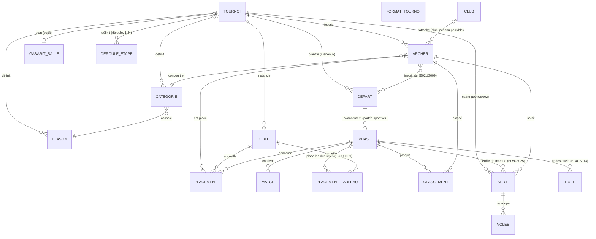

# Modèle de données détaillé — Kervignarc

- **Version** : 0.13
- ⚠️ **Retard connu (`DETTE-096`)** : les migrations **0048 → 0051** ne sont pas encore reflétées ici — tables `franchissement_arret`, `arret_de_circonstance`, `identite_tournoi`, et colonnes `poste.noms_par_page` / `cadence_page_s`. La date ci-dessous est celle de la **dernière entrée**, pas d'un audit du schéma.
- **Date** : 2026-08-31 *(v0.13 : `TOURNOI` gagne **`podium_portees`** et **`podium_profondeur`** — ce que le tournoi récompense et sur combien de places, réglage **du tournoi** comme `cloisonnement` — E16US014, [ADR-0103](adr/0103-la-portee-d-un-podium-est-un-reglage-du-tournoi.md), migration 0052)*
- *v0.12 : 2026-08-07 — **la définition quitte `PHASE`** — table **`DEROULE_ETAPE`** neuve (le déroulé, défini **une fois** au tournoi : `ordre`, `type`, `config`), `PHASE` réduite à l'**avancement** d'une étape dans un créneau (`depart_id`, `ordre`, `statut`) et perd `type`/`config` — E01US025, [ADR-0076](adr/0076-un-deroule-defini-une-fois-un-avancement-par-depart.md), migration 0043)*
- *v0.11 : 2026-08-06 — **`PHASE` change de parent** — `depart_id` remplace `tournoi_id`, le **départ** devenant la portée sportive (séquence, classements, tableaux, duels). Rattrapage d'une divergence de treize mois avec [ADR-0017](adr/0017-le-depart-est-un-creneau-du-tournoi.md), qui l'avait décidé sans que le moteur le porte — E01US025, [ADR-0075](adr/0075-le-depart-est-la-portee-sportive.md), migration 0042)*
- *v0.10 : 2026-08-04 — `TOURNOI` gagne `cloisonnement` — ce qu'une cible n'a pas le droit de mêler (`aucun` | `categorie` | `blason` | `blason_et_categorie`), réglage **activable** du tournoi et non du gabarit, qui est partagé entre tournois — E03US007, [ADR-0071](adr/0071-cloisonnement-categorie-blason-active-et-dur.md), migration 0041)*
- *v0.9 : 2026-08-04 — `TOURNOI` gagne `effectif_minimum_exige` et `FORMAT_TOURNOI.config` la clé sœur — le minimum d'inscrits **exigé** par le club ; le plancher **technique**, lui, se déduit des prélèvements et n'est **pas** stocké — E05US021, [ADR-0069](adr/0069-effectif-minimum-deduit-et-exige.md), migration 0040)*
- *v0.8 : 2026-07-31 — `ARCHER` gagne `handicap_officiel` et `handicap_surcharge` — deux valeurs et non une, la surcharge primant l'officiel pour une édition — E05US015, [ADR-0062](adr/0062-catalogue-de-types-de-phase.md), migration 0037*
- *v0.7 : 2026-07-31 — les **briques deviennent le patrimoine du club** — `CATEGORIE.tournoi_id` et `BLASON.tournoi_id` passent **nullable** (`NULL` = modèle de bibliothèque), les deux tables gagnent `origine`, et la table **`FORMAT_TOURNOI`** apparaît (sans FK vers `TOURNOI`) — E01US023, [ADR-0060](adr/0060-briques-du-patrimoine-du-club-bibliotheque-copie-promotion.md), migrations 0034 et 0035)*
- *v0.6 : 2026-07-27 — `DEPART.horaire` devient un horaire du jour `HH:MM` **NOT NULL** (abandon du libellé libre facultatif) — E02US010, migration 0032*
- *v0.5 : 2026-07-16 — table de liaison `INSCRIPTION` (archer ↔ départ, portant `paye`) — E02US009, [ADR-0017](adr/0017-le-depart-est-un-creneau-du-tournoi.md) ; montant dû **dérivé** du tarif du départ, non stocké*
- *v0.4 : 2026-07-16 — `DEPART` devient un **créneau du tournoi** (`tournoi_id`, `horaire`, `tarif_centimes` obligatoire), le tarif **quitte** `TOURNOI` — [ADR-0017](adr/0017-le-depart-est-un-creneau-du-tournoi.md), E02US004 ; le lien archer↔départ + `paye` passent à E02US009*
- *v0.3 : 2026-07-15 — `ARCHER.club_id` **nullable** = club *inconnu* et index UNIQUE de dédoublonnage **abandonné** ([ADR-0014](adr/0014-club-inconnu-plutot-que-club-sentinelle.md), [ADR-0015](adr/0015-signaler-un-doublon-plutot-que-l-interdire.md)) ; `ARCHER.categorie_id` NOT NULL*
- *v0.2 : 2026-07-14 — cadrage FFTA (`CATEGORIE.ages`, `BLASON.zones`, capacité de cible non bornée, barème par arme, blason surchargé par phase)*
- **Base** : SQLite (WAL), ORM SQLAlchemy, migrations Alembic (ADR-0002, ADR-0005)
- **Source** : dérive du CDC technique §5 ; termes selon `glossaire.md` ; règles métier selon [`referentiel-ffta.md`](referentiel-ffta.md).

> Les entités du **domaine** restent pures ; ce schéma décrit la **persistance** (adapters). Les DTO d'API sont distincts (ADR-0007). Types indicatifs SQLite (`INTEGER`, `TEXT`, `REAL`, `BOOLEAN`, `TEXT`(ISO-8601) pour les dates, `TEXT`(JSON) pour les configs).

## Vue d'ensemble (relations)


```mermaid
erDiagram
    TOURNOI |o--o{ CATEGORIE : "définit"
    TOURNOI |o--o{ BLASON : "définit"
    TOURNOI ||--o{ ARCHER : "inscrit"
    TOURNOI ||--o{ CIBLE : "instancie"
    TOURNOI |o--o| GABARIT_SALLE : "plan (copie)"
    TOURNOI ||--o{ DEPART : "planifie (créneaux)"
    %% Le DÉPART est la **portée sportive** : il rejoue le tournoi en entier, donc il porte la
    %% séquence de phases, ses classements et ses tableaux (ADR-0075). La PHASE pendait au TOURNOI
    %% jusqu'au 06/08/2026 — treize mois de divergence avec ADR-0017, qui l'avait pourtant décidé.
    %% Depuis ADR-0076, la **définition** du déroulé est au TOURNOI (DEROULE_ETAPE, une seule fois)
    %% et la PHASE n'est plus que l'**avancement** de cette étape dans un créneau. Le lien
    %% définition ↔ avancement se fait par `ordre`, pas par une FK (cf. DEROULE_ETAPE).
    TOURNOI ||--o{ DEROULE_ETAPE : "définit (déroulé, 1..N)"
    DEPART ||--o{ PHASE : "avancement (portée sportive)"
    %% FORMAT_TOURNOI et CLUB n'ont **aucune** FK vers TOURNOI : ce sont des
    %% référentiels du club, pas de la descendance d'une édition (E01US023).
    FORMAT_TOURNOI

    CLUB |o--o{ ARCHER : "rattache (club inconnu possible)"
    CATEGORIE }o--|| BLASON : "associe"
    ARCHER }o--|| CATEGORIE : "concourt en"
    ARCHER }o--o{ DEPART : "inscrit sur (E02US009)"
    ARCHER ||--o{ PLACEMENT : "est placé"
    CIBLE ||--o{ PLACEMENT : "accueille"
    PHASE ||--o{ MATCH : "contient"
    PHASE ||--o{ PLACEMENT : "concerne"
    PHASE ||--o{ PLACEMENT_TABLEAU : "place les duellistes (E03US009)"
    CIBLE ||--o{ PLACEMENT_TABLEAU : "accueille"
    PHASE ||--o{ CLASSEMENT : "produit"
    TOURNOI ||--o{ SERIE : "cadre (E04US002)"
    PHASE ||--o{ SERIE : "feuille de marque (E05US025)"
    ARCHER ||--o{ SERIE : "saisit"
    SERIE ||--o{ VOLEE : "regroupe"
    PHASE ||--o{ DUEL : "tir des duels (E04US013)"
    ARCHER ||--o{ CLASSEMENT : "classé"
```

---

## Entités

### TOURNOI
| Champ | Type | Contraintes |
|---|---|---|
| id | INTEGER | PK |
| nom | TEXT | NOT NULL |
| date | TEXT (date) | NOT NULL |
| lieu | TEXT | |
| type_tournoi | TEXT | `officiel` \| `non_officiel` |
| statut | TEXT | `brouillon` \| `prêt` \| `en_cours` \| `en_pause` \| `termine` \| `archive` \| `annule` — **7 statuts** ([ADR-0026](adr/0026-cycle-de-vie-du-tournoi-sept-statuts.md), E01US017) |
| cloisonnement | TEXT | NOT NULL, défaut `aucun` — ce qu'une cible n'a pas le droit de mêler : `aucun` \| `categorie` \| `blason` \| `blason_et_categorie`. Contrainte de placement **activable** (RG-4) et **dure** quand elle l'est. Sur le tournoi et non sur `GABARIT_SALLE`, qui est une brique **partagée** : deux tournois du même plan de salle peuvent cloisonner différemment. « Aucun » est une **valeur**, pas un `NULL` (E03US007, [ADR-0071](adr/0071-cloisonnement-categorie-blason-active-et-dur.md), migration 0041) |
| podium_portees | TEXT | NOT NULL, défaut `["categorie"]` — **tableau JSON** des portées de podium retenues : `scratch` \| `categorie` \| `club`, **cumulables**. Un tableau et non une colonne par portée : elles s'additionnent, et une colonne chacune figerait l'énumération dans le schéma (la portée *équipe* d'A16 viendra avec EPIC-13). Le défaut **est** le comportement d'E06US004 : un tournoi antérieur ne change pas d'affichage (E16US014, [ADR-0103](adr/0103-la-portee-d-un-podium-est-un-reglage-du-tournoi.md), migration 0052) |
| podium_profondeur | INTEGER | NOT NULL, défaut `4` — le nombre de places d'un podium, borné 1..64 par le **domaine** (`ReglagePodiums`) et non par un `CHECK`. ⚠️ **À ne pas confondre avec la politique `depth`** de `PHASE.config` : celle-ci décide jusqu'où le tableau **départage**, celle-là combien de places le palmarès **affiche** (E16US014, [ADR-0103](adr/0103-la-portee-d-un-podium-est-un-reglage-du-tournoi.md) §4, migration 0052) |
| effectif_minimum_exige | INTEGER | `NULL` = aucune exigence propre. Le minimum d'inscrits **exigé** par le club, recopié du format à son application ; le plancher **technique** n'est pas ici — il se **déduit** des phases à chaque lecture, pour ne pas se périmer quand le déroulé change (E05US021, [ADR-0069](adr/0069-effectif-minimum-deduit-et-exige.md), migration 0040) |
| created_at | TEXT (datetime) | |

> **Le tarif n'est plus au tournoi** ([ADR-0017](adr/0017-le-depart-est-un-creneau-du-tournoi.md),
> E02US004) : `tarif_depart_centimes` a été **retiré** de `TOURNOI` (migration `0016`) et vit
> désormais sur `DEPART` — un tournoi peut se jouer sur plusieurs créneaux à prix différents.

> Le plan de salle d'un tournoi n'est **pas** une FK sur `TOURNOI` : c'est une **copie** rangée
> dans `GABARIT_SALLE` et pointant vers le tournoi (`GABARIT_SALLE.tournoi_id`), pour pouvoir
> l'ajuster sans altérer le modèle réutilisable (E01US008). Un tournoi a au plus une telle copie.

### CLUB
| id | INTEGER | PK |
| nom | TEXT | NOT NULL, UNIQUE |

> **Référentiel global (E02US001).** Seule table **sans** `tournoi_id` : les clubs sont réutilisés
> d'une compétition à l'autre. Elle n'appartient donc pas à la descendance de `TOURNOI` — supprimer
> un tournoi ne touche pas aux clubs, et [DETTE-001](dette.md) ne la concerne pas.
>
> **`UNIQUE` = garde-fou d'intégrité, pas la règle fonctionnelle.** La contrainte SQL est **exacte**
> (elle n'attrape que les homonymes au caractère près). Le refus présenté à l'utilisateur est plus
> large : `ServiceClubs` compare les noms au sens de `domain.club.cle_nom` — espaces de bord, casse
> **et accents** repliés, donc « Élan de Fougères » ≡ « elan de fougeres ». Un référentiel dont
> l'intérêt est de ne pas ressaisir ne doit pas offrir deux entrées pour un même club : les archers
> s'y répartiraient et les listes par club (EPIC-09) seraient fausses. `cle_nom` sert aussi de clé
> de **tri** à l'écran (sans elle, un tri par code point classerait « Élan » après « Zénith »).

### CATEGORIE
| id | INTEGER | PK |
| tournoi_id | INTEGER | FK → TOURNOI ; `NULL` = **modèle de bibliothèque** (patrimoine du club, réutilisable d'une année sur l'autre), renseigné = **copie** appartenant à un tournoi, ajustable sans altérer le modèle (E01US023, [ADR-0060](adr/0060-briques-du-patrimoine-du-club-bibliotheque-copie-promotion.md)) |
| origine | TEXT | NOT NULL — `ffta` \| `utilisateur` : **provenance** de la brique (deux listes séparées à l'atelier). Ne dit **pas** la conformité au règlement — il y manque sa version (ADR-0060 §4) |
| libelle | TEXT | NOT NULL — ex. « Arc Nu U18 Homme » |
| arme | TEXT | ex. `classique`/`poulie`/`nu` |
| ages | TEXT (JSON) | **une ou plusieurs** tranches — ex. `["U15","U18"]` |
| sexe | TEXT | `H`\|`F`\|`mixte` |
| blason_id | INTEGER | FK → BLASON (défaut) |
| hauteur_cm | INTEGER | NOT NULL — hauteur du centre de l'or, cm (130 défaut, 110 U11) |

> ⚠️ **Une catégorie n'est pas le triplet `arme × âge × sexe`** — c'est une **entité nommée** portant une
> **règle d'éligibilité** (CDC fonctionnel EF-1.2). La FFTA regroupe des tranches d'âge : en arc nu,
> la catégorie « U18 » couvre **U15 et U18**, et « Scratch » couvre **U21, S1, S2, S3**
> ([référentiel §3](referentiel-ffta.md)). Une colonne `tranche_age` scalaire rend ces cas
> indistinguables — le même libellé « U18 » désignerait une tranche en classique et deux en arc nu.
> D'où `ages` (liste). Invariant à tenir : au sein d'un tournoi, un archer donné (arme, âge, sexe)
> ne doit être éligible qu'à **une seule** catégorie.

### BLASON
| id | INTEGER | PK |
| tournoi_id | INTEGER | FK → TOURNOI ; `NULL` = **modèle de bibliothèque** (patrimoine du club, réutilisable d'une année sur l'autre), renseigné = **copie** appartenant à un tournoi, ajustable sans altérer le modèle (E01US023, [ADR-0060](adr/0060-briques-du-patrimoine-du-club-bibliotheque-copie-promotion.md)) |
| origine | TEXT | NOT NULL — `ffta` \| `utilisateur` : **provenance** de la brique (deux listes séparées à l'atelier). Ne dit **pas** la conformité au règlement — il y manque sa version (ADR-0060 §4) |
| nom | TEXT | NOT NULL |
| taille | REAL | fraction de place (0 < taille ≤ 1) |
| capacite | INTEGER | ≥ 1 |
| zones | TEXT (JSON) | valeurs de score admises — ex. `["10","9","8","7","6","M"]` |

> **`zones`** — Les valeurs tirables dépendent du **blason**, pas du barème de la phase : un
> **triple 40 n'a pas les zones 5 → 1** (son minimum est le bleu clair = 6, [référentiel §4.4](referentiel-ffta.md)),
> et le « 10 intérieur » des poulies est un cercle plus petit que le 10 classique (§4.3). C'est
> `zones` qui pilote le pavé de saisie de la tablette (EF-5.2).
>
> *Livré en E01US014* (migration `0019`, [ADR-0020](adr/0020-blason-zones-vocabulaire-ferme-et-defaut-sur-ensemble.md)).
> Vocabulaire fermé à `10`→`1` et `M` (§4.2), porté par l'énuméré `ZoneScore` et validé **à la
> frontière** (400), comme `TrancheAge` pour `ages` (ADR-0019). Les règles **structurelles** restent
> au domaine (422) : `M` toujours présent, au moins une zone marquante, pas de doublon, ordre
> canonique normalisé. Un jeu **non contigu** est admis — la contiguïté ne sert aucun consommateur,
> et RG-8 interdit d'imposer le règlement. Le « 10 intérieur » **n'ajoute pas de valeur** (c'est une
> géométrie, le score reste 10) et la **mouche (X)** n'est pas une zone.
>
> **Défaut = `["10",…,"1","M"]`** (blason simple complet), y compris pour le backfill des lignes
> existantes : `taille` étant une *fraction de place* et non un diamètre, rien ne distingue un
> triple d'un blason simple. ⚠️ **Les triples antérieurs à `0019` sont à corriger à la main** —
> EPIC-04 ne doit pas supposer `zones` fiable sur une donnée antérieure à cette migration.
>
> **La hauteur du centre vit sur `CATEGORIE`, pas sur le blason** (`CATEGORIE.hauteur_cm` : 110 cm
> pour les U11, 130 cm sinon, §5). Elle interdit à un U11 de partager une butte avec des adultes et
> n'est **pas** réductible à `taille` : le placement en fait une contrainte de 1er rang (une butte,
> une hauteur). *Résorbe [DETTE-002](dette.md) en E03US001* ([ADR-0022](adr/0022-hauteur-de-centre-sur-la-categorie.md),
> migration `0020`) — l'option « hauteur sur le blason » a été écartée : la hauteur suit la catégorie
> d'âge de l'archer, pas le carton.

### ARCHER
| id | INTEGER | PK |
| tournoi_id | INTEGER | FK → TOURNOI, NOT NULL |
| nom | TEXT | NOT NULL |
| prenom | TEXT | NOT NULL |
| club_id | INTEGER | FK → CLUB, **nullable** — `NULL` = club *inconnu*, jamais « aucun club » ([ADR-0014](adr/0014-club-inconnu-plutot-que-club-sentinelle.md)) |
| categorie_id | INTEGER | FK → CATEGORIE, **NOT NULL** |
| cible | INTEGER | **nullable** — placement **provisoire** du walking skeleton (E00US011) : un simple numéro, sans capacité ni contrainte de blason. Remplacé par `PLACEMENT` en EPIC-03. `NOT NULL` ⇒ archer *placé*, ce qui suspend sa suppression ([ADR-0016](adr/0016-supprimer-un-archer-engage-plutot-que-le-refuser.md)) |
| handicap_officiel | INTEGER | **nullable** — handicap de référence, entretenu par le club (E05US015, migration `0037`) |
| handicap_surcharge | INTEGER | **nullable** — handicap qui **prime** l'officiel pour cette édition |

> **Handicap (E05US015, [ADR-0062](adr/0062-catalogue-de-types-de-phase.md) §6).** Deux colonnes et
> non une, à la demande du commanditaire : une valeur **officielle** que le club entretient d'une
> saison à l'autre, et une **surcharge** locale au tournoi pour le cas où elle est visiblement
> périmée (un jeune qui progresse vite, un archer qui reprend après une longue absence). Le handicap
> **effectif** est dérivé (`surcharge ?? officiel ?? 0`) et n'est pas stocké.
>
> `NULL` signifie « **non renseigné** », **distinct** d'un handicap à `0` : les deux concourent
> pareil au scratch, mais seul le second a été évalué. C'est pourquoi les colonnes sont nullables
> **sans valeur par défaut** — un `DEFAULT 0` aurait effacé la distinction sur toutes les lignes
> existantes, en affirmant que chaque archer déjà en base a été évalué à zéro.
>
> ⚠️ **Aucune table de handicap n'est fournie par le produit.** La FFTA n'a pas de système officiel ;
> celui qui fait référence est anglo-saxon (Archery GB / World Archery). En reconstituer une
> produirait des classements **plausibles mais faux**. Le schéma ouvre l'emplacement, le club répond
> de la valeur.

> **`club_id` posé par E02US001** (migration `0014`) ; `prenom` et `categorie_id` par E02US002
> (migration `0015`). Le rattachement au club est arrivé avec le **référentiel** plutôt qu'avec
> l'inscription complète parce qu'il est ce qui rend le CA « un club utilisé n'est pas supprimable »
> **exerçable** : sans lui, le refus (`ClubReference` → 409) n'aurait été qu'un garde-fou qu'aucun
> chemin réel ne déclenche.
>
> **`club_id` reste nullable, `categorie_id` ne l'est pas** — asymétrie décidée en
> [ADR-0014](adr/0014-club-inconnu-plutot-que-club-sentinelle.md) : le club est une donnée
> administrative externe qu'on ignore parfois au guichet (mais que la FFTA impose : le `NULL` est
> une **anomalie à résorber**, signalée à l'écran et comptée par E12US005), là où la catégorie se lit
> sur l'archer présent et commande classement, placement et facturation. **Aucun club « Sans club »
> ne doit être introduit** pour combler les `NULL` : deux archers y porteraient le même `club_id` et
> le placement (E03US006, RG-3) les croirait du même club — voir l'ADR.
>
> **Pas d'index UNIQUE de dédoublonnage** (le modèle v0.2 prévoyait
> `UNIQUE(tournoi_id, nom, prenom, club_id)`) : il rejetterait un père et son fils, homonymes du
> même club. Le doublon probable est **signalé** par le service (409 `homonyme_archer`, au sens de
> `domain.archer.cle_identite`) et l'admin confirme — [ADR-0015](adr/0015-signaler-un-doublon-plutot-que-l-interdire.md).
> Le contrôle applicatif suffit : le **writer unique** sérialise les écritures, et le contrôle comme
> l'insertion tiennent dans la même commande en file. La détection fine et la fusion sont à
> **E02US005**.
>
> `club_id` est **hors du périmètre de [DETTE-001](dette.md)**, à la différence des autres FK
> d'`ARCHER` (`tournoi_id`, `categorie_id`) : elle pointe vers `CLUB`, qui n'est pas dans la
> descendance de `TOURNOI`. Supprimer un tournoi (donc ses archers) ne la viole jamais — c'est le
> sens inverse qu'elle contraint, et ce cas-là est **tranché** par le service, comme l'est déjà
> `CATEGORIE.blason_id`.

### DEPART
| Champ | Type | Contraintes |
|---|---|---|
| id | INTEGER | PK |
| tournoi_id | INTEGER | FK → TOURNOI, NOT NULL |
| numero | INTEGER | n° de créneau, **attribué par le système** ; `UNIQUE(tournoi_id, numero)` |
| horaire | TEXT | horaire du jour `HH:MM` (24 h, ex. « 09:00 »), **NOT NULL** (E02US010) |
| tarif_centimes | INTEGER | **NOT NULL**, ≥ 0 — prix du créneau en **centimes** (`0` = gratuit) |
| quota | INTEGER | **NULL admis** = sans plafond ; sinon nombre max d'inscrits, `1 ≤ quota ≤ 1 000` (E02US006). Invariant **applicatif** (`DepartComplet`, règle 7) : aucune contrainte SQL ne l'exprime — le dépassement est refusé par le service, sérialisé par le writer unique |

> **Le départ est un créneau du tournoi** ([ADR-0017](adr/0017-le-depart-est-un-creneau-du-tournoi.md),
> E02US004), partagé par les archers qui s'y inscrivent — il n'appartient **pas** à un archer. Le lien
> **archer ↔ départ** (inscription, portant `paye` ; montant dû **dérivé** du `tarif_centimes` du
> départ) est la table de liaison d'**E02US009**, pas de cette US — c'est là que reviennent les
> colonnes `montant_du`/`paye` que la v0.3 posait à tort ici.
> **Centimes entiers** ([ADR-0012](adr/0012-argent-en-centimes-entiers.md)) : c'est sur `tarif_centimes`
> que porteront les **sommes** d'EPIC-08/09 (montant par archer = somme des tarifs de ses départs), là
> où un REAL dériverait. Le tarif est **obligatoire** : l'état « non défini » qu'avait le tarif du
> tournoi disparaît (on ne crée pas un créneau sans prix) ; `0` = gratuit reste distinct. FK
> `depart → tournoi` **sans `ON DELETE`** → [DETTE-001](dette.md).

### INSCRIPTION
| Champ | Type | Contraintes |
|---|---|---|
| id | INTEGER | PK |
| archer_id | INTEGER | FK → ARCHER, NOT NULL |
| depart_id | INTEGER | FK → DEPART, NOT NULL |
| paye | BOOLEAN | NOT NULL, défaut `false` |

> **Table de liaison archer ↔ départ** (E02US009, [ADR-0017](adr/0017-le-depart-est-un-creneau-du-tournoi.md)) :
> l'inscription d'un archer sur un **créneau** du tournoi. `UNIQUE(archer_id, depart_id)` — un archer ne
> s'inscrit **qu'une fois** sur un même départ (une seconde tentative est un `DejaInscrit`, 409, pas un
> doublon toléré comme l'homonyme). L'invariant « archer et départ du **même tournoi** » est tenu par le
> **service** (l'entité `Inscription` ne porte que les deux clés) : un départ d'un autre tournoi est
> *introuvable* du point de vue de l'archer.
> **Le montant dû n'est pas une colonne** : il se **dérive** du `tarif_centimes` du départ à la lecture
> (rien à recopier, rien à resynchroniser). C'est l'erreur que la v0.3 faisait en posant
> `montant_du_centimes`/`paye` sur `DEPART` ; seul `paye` — un **fait** propre à l'inscription, non
> dérivable — vit ici. Les **sommes** d'EPIC-08 (montant par archer = somme des tarifs de ses départs)
> se calculent par jointure `INSCRIPTION → DEPART`.
> **Deux FK sans `ON DELETE`** (`archer_id`, `depart_id`) → [DETTE-001](dette.md) : la suppression
> d'un archer (E02US003) **et** celle d'un départ (E02US009) purgent les inscriptions par **cascade
> applicative** dans la transaction de l'adapter, jamais par `ON DELETE CASCADE` en base.

### GABARIT_SALLE
| id | INTEGER | PK |
| nom | TEXT | NOT NULL |
| nb_cibles | INTEGER | ≥ 1 |
| config | TEXT (JSON) | capacités et positions par cible |
| tournoi_id | INTEGER | FK → TOURNOI ; `NULL` = **modèle** réutilisable, renseigné = **copie** appliquée à un tournoi (E01US008) |

### FORMAT_TOURNOI
| id | INTEGER | PK |
| nom | TEXT | NOT NULL, **UNIQUE** — c'est ce qui rend la promotion idempotente (promouvoir deux fois sous le même nom met à jour au lieu de créer un homonyme) |
| origine | TEXT | NOT NULL — `ffta` \| `utilisateur`, même sens que ci-dessus |
| config | TEXT (JSON) | la **séquence de modèles de phases**, et ce qui appartient au format entier — `{"etapes": [{"ordre", "type", "policies"?, "validation"?, "sources"?, "effectif"?}, …], "effectif_minimum_exige"?: int}`. Les étapes ont la même forme que `PHASE.config` (migrées **ensemble** par `0036`) ; `effectif_minimum_exige` (E05US021) s'y ajoute **sans migration**, la clé étant **omise** quand rien n'est exigé — une config d'avant l'US et une config sans exigence sont ainsi le même document |

> **Aucune FK vers TOURNOI**, et ce n'est pas un oubli : un format n'existe qu'en bibliothèque
> (E01US023, [ADR-0060](adr/0060-briques-du-patrimoine-du-club-bibliotheque-copie-promotion.md) §5).
> Sa « copie » dans un tournoi n'est pas une ligne de cette table, ce sont les lignes de `PHASE`
> produites par son application. La table n'appartient donc **pas** à la descendance de `TOURNOI` —
> même régime que `CLUB`, et DETTE-001 ne la concerne pas.
>
> **Pourquoi une table neuve** plutôt qu'un `tournoi_id` nullable sur `PHASE`, comme pour `CATEGORIE`
> et `BLASON` : le barème n'est pas une entité (il vit dans `PHASE.config`), et l'invariant d'une
> phase est **collectif** — les ordres d'une séquence forment la suite contiguë 1..N. Des phases de
> bibliothèque porteraient un statut vide de sens et des ordres en collision.

### CIBLE
| id | INTEGER | PK |
| tournoi_id | INTEGER | FK → TOURNOI |
| index_cible | INTEGER | n° de cible |
| capacite | INTEGER | ≥ 1 — usuellement 1 / 2 / 4, **non borné** (la FFTA décrit aussi 3 triples verticaux, §5) |

### PLACEMENT
Table du **plan de cibles matérialisé** livrée par E03US004
([ADR-0024](adr/0024-plan-de-cibles-materialise-ajustable.md)) — une **affectation par inscription**
(VO domaine `Affectation`) : l'unité persistée du plan d'un départ, ajustable au glisser-déposer. Un
inscrit **sans** ligne est en **réserve**.

| inscription_id | INTEGER | **PK**, FK → INSCRIPTION, **ON DELETE CASCADE** |
| depart_id | INTEGER | FK → DEPART, **ON DELETE CASCADE** ; dénormalisé (lit/réécrit le plan d'un départ sans jointure) |
| cible_index | INTEGER | rang de la cible dans le gabarit (1-based) |
| position | TEXT | `A`\|`B`\|`C`\|`D`\|`E`… — lettres, **non bornées à D** (capacité de cible non bornée, cf. `CIBLE` ; le **code** plafonne encore à 4 → [DETTE-010](dette.md), résorption E01US019) |

> **`ON DELETE CASCADE` assumé** (à rebours de DETTE-001) : donnée **dérivée, reconstructible et
> feuille** — l'auto la régénère, sa disparition suit celle de l'inscription/du départ (ADR-0024).
>
> **Cible par `cible_index`, pas FK → CIBLE** : le gabarit (E01US008) porte ses cibles/capacités en
> JSON (la table `CIBLE` ci-dessus reste un **modèle non encore matérialisé**) ; l'index 1-based du
> gabarit suffit à désigner la butte.
>
> **Placement par phase — table dédiée, pas d'extension de celle-ci** (révisé E03US009,
> [ADR-0048](adr/0048-cote-a-cote-des-duellistes-par-reordonnancement.md)). L'intuition initiale
> était d'**étendre** cette table (`phase_id` nullable, clé par archer) le jour où le placement
> deviendrait une phase. ADR-0048 §2 a **écarté** cette voie : ajouter un discriminant de phase
> aurait changé la PK `inscription_id` et touché tout le `PlacementRepository`/`ON DELETE CASCADE`
> existants, pour un besoin **orthogonal** (un archer a une pose en **qualif** *et* une en **tableau**,
> logiquement disjointes). Le plan de duels vit donc dans une **seconde table dédiée**,
> `PLACEMENT_TABLEAU` (ci-dessous) — `PLACEMENT` reste la table du **plan de cibles de qualification**,
> inchangée.

### PLACEMENT_TABLEAU
Table du **plan de duels matérialisé** livrée par E03US009
([ADR-0048](adr/0048-cote-a-cote-des-duellistes-par-reordonnancement.md)) : le placement des
**duellistes** d'une **phase de tableau** (élimination directe), scoppé par **phase** (≠ départ pour
la qualif). Une **affectation par inscription et par phase** (VO domaine `Affectation`), ajustable au
glisser-déposer. L'**appariement** (qui affronte qui) n'est **pas** persisté : il est **recalculé** du
classement à chaque régénération (déterministe, [ADR-0023](adr/0023-moteur-de-placement-glouton-deterministe.md)) ;
seule la **pose** l'est. Un duelliste **sans** ligne est en **réserve**.

| phase_id | INTEGER | **PK** (composite), FK → PHASE, **ON DELETE CASCADE** |
| inscription_id | INTEGER | **PK** (composite), FK → INSCRIPTION, **ON DELETE CASCADE** |
| cible_index | INTEGER | rang de la cible dans le gabarit (1-based) |
| position | TEXT | `A`\|`B`\|`C`\|`D`… — lettres (même plafond code que `PLACEMENT`, DETTE-010) |

> **PK composite `(phase_id, inscription_id)`** : un archer a **au plus une** case par phase, mais une
> pose en qualif *et* une en tableau (deux tables). Aucune contrainte d'unicité sur
> `(phase_id, cible_index, position)` — la non-double-occupation est tenue par le **service** (comme
> `PLACEMENT`) ; une pose devenue **orpheline** (inscription qui n'est plus duelliste du 1er tour après
> un recalcul du classement) est **masquée en lecture** et **purgée à l'écriture** (ADR-0048, arbitrage
> de revue). **`ON DELETE CASCADE` assumé** (exception DETTE-001, comme `PLACEMENT`) : donnée dérivée,
> reconstructible, feuille — elle suit la phase ou l'inscription.

### PLACEMENT_PAR_BLOC (E05US023, [ADR-0083](adr/0083-le-contrat-de-phase-jouable.md) §3)
Table du **plan de cibles d'un groupe de tireurs** — migrations `0045` puis `0046`. Ce qui est posé
n'est **pas l'archer** mais le **groupe** : il occupe un **bloc de couloirs contigus**, et c'est ce
bloc qui est persisté. L'occupant d'un couloir change à chaque tour, donc le stocker n'aurait décrit
qu'un tour sur trois. La **taille** du bloc est l'empreinte simultanée sur la ligne —
`2 × (effectif ÷ 2)` couloirs —, pas l'effectif du groupe.

⚠️ **Renommée en E05US026** (`placement_poule` → `placement_par_bloc`, `poule_numero` →
`groupe_numero`, migration `0046` réversible sans perte). Le mécanisme sert désormais **deux
formats** : une **poule** (un bloc par groupe, le membre au repos tourne) et une **ronde de système
suisse** (un bloc unique pour tout le plateau, l'appariement change à chaque ronde). Le nom d'origine
désignait donc le mauvais concept — arbitrage inverse de `DETTE-042`, où le mot est seulement
imparfait et la migration différée.

| phase_id | INTEGER | **PK** (composite), FK → PHASE, **ON DELETE CASCADE** |
| cible_index | INTEGER | **PK** (composite) — rang de la cible dans le gabarit (1-based) |
| position | TEXT | **PK** (composite) — `A`\|`B`\|`C`\|`D`… (même plafond code que `PLACEMENT`, `# DETTE-042`) |
| groupe_numero | INTEGER | le groupe qui occupe ce couloir — poule *n*, ou `1` pour le plateau d'un suisse |
| rang | INTEGER | position du couloir **dans le bloc** (0-based) ; `UNIQUE (phase_id, groupe_numero, rang)` |

> **PK composite `(phase_id, cible_index, position)`** : un couloir est occupé par **au plus un**
> groupe dans une phase — la non-double-occupation est ici tenue par le **schéma**, contrairement à
> `PLACEMENT`/`PLACEMENT_TABLEAU` où elle l'est par le service, parce que l'unité posée est un bloc
> et non une personne. `UNIQUE (phase_id, groupe_numero, rang)` tient l'autre bout : un bloc est une
> **suite** ordonnée, deux couloirs ne peuvent pas partager le même rang. **`ON DELETE CASCADE`
> assumé** (exception DETTE-001, comme ses deux sœurs) : donnée dérivée, reconstructible, feuille.
> La pose est **grossière par construction** — on repose tout le plan — parce que la contiguïté d'un
> bloc est l'invariant du format et qu'un déplacement unitaire la casserait.

### DEROULE_ETAPE (E01US025, [ADR-0076](adr/0076-un-deroule-defini-une-fois-un-avancement-par-depart.md))
| id | INTEGER | PK |
| tournoi_id | INTEGER | FK → TOURNOI, NOT NULL — le déroulé se **définit au tournoi**, une seule fois |
| ordre | INTEGER | position dans le déroulé (1..N contigus **par tournoi**) ; `UNIQUE (tournoi_id, ordre)` |
| type | TEXT | `qualification`\|`barrage`\|`elimination_directe`\|`placement`\|`echauffement`\|`poules`\|`big_shoot_off`\|`suisse`\|`colline` |
| config | TEXT (JSON) | **politiques** + paramètres — forme inchangée, elle a seulement **changé de table** (voir §Config d'une étape) |

> **Une définition, N avancements.** Jusqu'au 07/08/2026, appliquer un format à un tournoi de 4
> créneaux écrivait **4 copies complètes** de chaque phase, libres de diverger en silence (barème du
> départ 3 s'écartant des autres). `DEROULE_ETAPE` porte la **définition** — commune au tournoi — et
> `PHASE` ne garde que l'**avancement** — propre au créneau. La divergence n'est plus improbable :
> elle est **impossible**, il n'y a qu'un exemplaire.
>
> **La jointure définition ↔ avancement se fait par `ordre`**, pas par une FK `phase.etape_id`. Le
> déroulé s'édite **par rang**, et un réordonnancement remappe déjà les ordres partout ; une FK
> dupliquerait l'information tout en pouvant en diverger. ⚠️ La contrepartie est réelle et
> inscrite au registre (**DETTE-026**) : le rang étant à la fois la clé de la séquence **et** la clé
> de jointure, tout réordonnancement passe par un état transitoire à rangs dupliqués — d'où le
> `reordonner` des deux repositories, qui gare les rangs hors de portée avant de les reposer.
>
> ⚠️ **Migration 0043** : les définitions sont reprises depuis les phases du **premier départ** de
> chaque tournoi. Les copies des autres créneaux sont **perdues si elles avaient divergé** — c'est le
> sens de la décision (elles n'auraient pas dû pouvoir diverger), mais c'est une perte réelle.

> **Histoire de `config`** *(elle est née sur `PHASE`, elle a changé de table en gardant sa forme)*.
>
> **Introduction minimale (E01US009 / [ADR-0011](adr/0011-phase-qualification-anticipee.md)).** La
> table `phase` était créée dès J1 pour héberger le **barème de qualification** dans `config.scoring`
> (`{"volees": N, "fleches": M, "mode": "cumul"}`) — une seule phase `qualification` par tournoi.
> `ordre` et `statut` étaient conformes au schéma mais **non exploités** avant le moteur (EPIC-05,
> ADR-0004), qui a ajouté les autres politiques dans `config` et les autres types/transitions.
>
> **Grain de validation (E01US015, `D-11`).** Deuxième politique de la même étape, dans
> `config.validation` (`{"grain": …}`, + `"n_volees": N` pour `toutes_les_n_volees`) — **sans
> migration**, comme l'annonçait l'ADR-0011. Une ligne écrite avant E01US015 n'a pas cette clé :
> elle se relit avec le **preset de son type** (`qualification` → `fin_de_serie`), et se complète à
> la première écriture. Le grain doit être **admis par le type** (pas de `fin_de_duel` sur une
> qualification) et sa cadence **ne peut pas dépasser** `config.scoring.volees` — sinon aucune
> validation n'aurait lieu ; les deux politiques sont donc **cohérentes par construction**.

### PHASE
| id | INTEGER | PK |
| depart_id | INTEGER | FK → DEPART, NOT NULL — **portée sportive** ([ADR-0075](adr/0075-le-depart-est-la-portee-sportive.md), migration 0042) |
| ordre | INTEGER | rang de l'étape **dans ce départ** (1..N contigus par départ) **et clé de jointure** vers `DEROULE_ETAPE` de même rang ; `UNIQUE (depart_id, ordre)` |
| statut | TEXT | `a_venir`\|`en_cours`\|`en_pause`\|`terminee` — `en_pause` **gèle la phase** ([ADR-0026](adr/0026-cycle-de-vie-du-tournoi-sept-statuts.md) §3, distinct du `en_pause` du tournoi) |

> **La phase est un avancement, plus une définition** (E01US025,
> [ADR-0076](adr/0076-un-deroule-defini-une-fois-un-avancement-par-depart.md), migration 0043) :
> `type` et `config` ont quitté la table pour `DEROULE_ETAPE`. En **mémoire**, l'agrégat `Phase`
> porte toujours sa définition — le repository l'**assemble** depuis l'étape de même rang (ADR-0003)
> —, de sorte que les modules qui lisent `phase.bareme` n'ont pas changé.

> **Changement de parent (E01US025, [ADR-0075](adr/0075-le-depart-est-la-portee-sportive.md),
> migration 0042).** `tournoi_id` devient `depart_id` : un **départ rejoue le tournoi en entier**,
> donc il porte sa propre séquence, ses propres classements et ses propres tableaux. Les rangs 1..N
> sont contigus **par départ**, et un prélèvement (`config.sources`) ne traverse jamais un départ.
> Les phases d'un tournoi sont désormais l'**union** de celles de ses départs — il n'en possède plus
> en propre.
>
> ⚠️ **Migration** : les tournois **mono-départ** se migrent sans perte (leur unique départ reçoit la
> séquence). Un tournoi **sans départ** ne peut pas conserver ses phases : la migration le traite
> explicitement plutôt que de laisser une FK orpheline.

### MATCH
| id | INTEGER | PK |
| phase_id | INTEGER | FK → PHASE, NOT NULL |
| numero | TEXT | ex. `M161` |
| tour | INTEGER | n° de tour |
| source_a | TEXT (JSON) | origine participant A (seed / gagnant M / perdant M / rang) |
| source_b | TEXT (JSON) | origine participant B |
| participant_a | TEXT (JSON) | participant A résolu `{genre, ref_id}` (archer **ou** équipe) |
| participant_b | TEXT (JSON) | participant B résolu |
| vainqueur | TEXT (JSON) | participant vainqueur `{genre, ref_id}` |
| statut | TEXT | `a_jouer`\|`en_cours`\|`termine`\|`bye`\|`forfait` |

> **Participants (ADR-0028, tranché E13US001)** — un match oppose des **participants**, pas des
> archers en dur : chaque participant est **soit** un archer individuel **soit** une équipe
> ([référentiel §6.3](referentiel-ffta.md) : équipes de 3). Le domaine l'exprime par le value object
> `Participant {genre, ref_id}` ([`backend/domain/participant.py`](../backend/domain/participant.py)),
> **opaque** au moteur (aucune branche `if équipe`, ADR-0028 décision n°3). La note « équipes hors
> périmètre » du cadrage du 14/07 est **caduque** depuis ADR-0028 (18/07). C'est pourquoi le match ne
> porte pas `archer_a_id`/`archer_b_id` mais `participant_a`/`participant_b` — le « à trancher **avant**
> d'écrire le moteur » l'est désormais : le moteur (E05US005) oppose des `Participant`.
>
> ⚠️ **`MATCH` n'est pas persisté** (E04US013, [ADR-0049](adr/0049-saisie-et-scoring-des-duels.md)) :
> les colonnes ci-dessus restent un **modèle prospectif** (une future US pourrait figer l'arbre). Fidèle
> à ADR-0048, l'arbre est **recalculé** du classement à la demande ; E04US013 ne persiste que le **tir**
> d'un match (table `DUEL` ci-dessous), keyé par `(phase_id, match_numero)` — pas de table `MATCH`.
> L'entité `EQUIPE`/`MEMBRE_EQUIPE` et la composition relèvent d'E13US002.

### SERIE (E04US002, clé descendue à la phase en E05US025)
| id | INTEGER | PK |
| tournoi_id | INTEGER | FK → TOURNOI, NOT NULL (DETTE-001) |
| archer_id | INTEGER | FK → ARCHER, NOT NULL (DETTE-001) |
| phase_id | INTEGER | FK → PHASE, NOT NULL, **ON DELETE CASCADE** (E05US025) |
| — | — | **UNIQUE(phase_id, archer_id)** — une feuille par archer **et par phase de tir** |

> ⚠️ **Depuis E05US028, une feuille sert aussi un Big Shoot Off.** La table n'a pas bougé (aucune
> migration), mais sa portée si : le tir d'une finale s'y écrit comme une qualification. La
> correspondance **manche → volées** est **dérivée du réglage et jamais stockée** — la manche *m*
> occupe les volées `(m-1)·V+1 … m·V`, avec `V = config.big_shoot_off.volees` de l'étape. Rien dans
> le schéma ne dit donc qu'une `VOLEE` de numéro 3 appartient à la manche 2 : c'est une lecture, pas
> une colonne. Conséquence pratique à connaître avant de toucher au réglage — **changer `volees` sur
> une phase déjà tirée re-partitionne des volées validées dans d'autres manches** (`DETTE-062`).

> Racine de l'agrégat de **saisie de qualification** (`Serie`, tranche persistance PR2a — la couture
> d'atomicité acte↔trace est [ADR-0035](adr/0035-atomicite-acte-trace-session-partagee.md)) : la
> grille d'un archer. Le **cumul n'est pas stocké** — il se recalcule des volées validées
> (`Serie.cumul`) ; seul l'état saisi est persisté. Les volées vivent dans la table enfant `VOLEE`
> (`serie_id`).
>
> ⚠️ **La clé métier est `(phase, archer)` depuis E05US025**
> ([ADR-0082](adr/0082-plusieurs-qualifications-dans-un-meme-deroule.md), migration `0044`), et non
> plus `(tournoi, archer)` : un déroulé peut enchaîner plusieurs qualifications — 3×20, puis une
> *haute* et une *basse* à 3×15 —, et l'archer y tient **une feuille par phase**. Ce changement
> **résorbe DETTE-046** (un archer inscrit sur deux créneaux n'avait qu'un emplacement pour ses
> flèches), la phase appartenant à un départ.
>
> `tournoi_id` est **conservé** sans être une clé : c'est le cadre que lisent les vues d'ensemble
> (`SerieRepository.par_tournoi`), pas une seconde source de vérité — le tournoi se déduit par
> `phase → depart → tournoi`. Un consommateur qui indexerait `par_tournoi` par `archer_id` n'en
> garderait qu'une au hasard : c'est `par_phase` qu'il lui faut.
>
> `tournoi_id` et `archer_id` restent **sans `ON DELETE`** = **DETTE-001** (donnée saisie de la
> descendance du tournoi ; la cascade `archer → serie` est **applicative**,
> `ArcherRepositorySQL.supprimer`). `phase_id`, lui, **cascade** : une phase supprimée emporte ses
> feuilles, comme le reste de sa descendance sportive.

### VOLEE (E04US002)
| id | INTEGER | PK |
| serie_id | INTEGER | FK → SERIE, NOT NULL, **ON DELETE CASCADE** |
| numero | INTEGER | rang de la volée dans le barème (`1..N`) |
| valeurs | TEXT (JSON) | zones de score, ex. `["10","9","M"]` |
| saisie_par | TEXT | marqueur déclaratif de saisie, nullable |
| validee_par | TEXT | scoreur ; **non NULL = verrou** (volée validée), nullable |
| created_at | TEXT (datetime) | le « quand » de la saisie (ex-017), NOT NULL |
| — | — | **UNIQUE(serie_id, numero)** — un seul rang N par série |

> Table **enfant** de `SERIE` (composant strict de l'agrégat). Le verrou n'est **pas** une colonne
> dédiée : `validee_par` non NULL **est** le verrou. Le total n'est pas stocké (cumul recalculé).
> `serie_id` en **`ON DELETE CASCADE`** — **hors** DETTE-001, comme `PLACEMENT` (feuille auto-cascadée).
> `created_at` est une **métadonnée de persistance** (comme l'`id`), **hors** de l'agrégat domaine
> `Volee` : posée par le repository via le port `Horloge` (UTC) et **préservée par numéro** au
> travers du purge + réinsertion (réécrire une série ne réinitialise pas le « quand »). Défaut SQL
> `CURRENT_TIMESTAMP` (filet à l'`ADD COLUMN NOT NULL`) ; relue, elle redevient *aware* (UTC).
>
> **Colonnes des tranches suivantes** (non encore livrées) : `saisie_uid` (idempotence **persistée**
> au rejeu offline — E04US009 ; l'idempotence de PR2b est **en mémoire**, ADR-0036, non une colonne).
> `VOLEE` couvre la **qualification** et, depuis E05US028, le **Big Shoot Off** (via `SERIE` dans les
> deux cas) ; la **saisie en duels** est livrée
> (E04US013) dans la table `DUEL` (ci-dessus), qui porte les volées de duel en **JSON** (elle ne
> réutilise pas `VOLEE`, agrégat de qualification distinct — [ADR-0049](adr/0049-saisie-et-scoring-des-duels.md)).

### DUEL (E04US013) — le **tir** d'un match
| phase_id | INTEGER | PK, FK → PHASE, **ON DELETE CASCADE** |
| match_numero | INTEGER | PK (position dans l'arbre reconstruit ; **pas** une FK — `MATCH` n'est pas persisté) |
| haut_genre / haut_ref | TEXT / INTEGER | identité du duelliste haut `{genre, ref_id}` (archer en MVP) |
| bas_genre / bas_ref | TEXT / INTEGER | identité du duelliste bas |
| manches | TEXT (JSON) | liste des sets : `[{numero, haut:[…zones…], bas:[…]}]` |
| barrage | TEXT (JSON) | shoot-off, nullable : `{haut, bas, gagnant}` |
| validee_par | TEXT | scoreur ; **NULL = non validé** |

> Le **résultat** d'un match du tableau, keyé `(phase_id, match_numero)`, `ON DELETE CASCADE` sur la
> phase (feuille, comme `PLACEMENT_TABLEAU`). Le **barème** n'est pas stocké (re-résolu de l'arme à la
> lecture). L'**identité des duellistes est persistée** ([ADR-0049](adr/0049-saisie-et-scoring-des-duels.md)
> §4) : elle n'est pas l'appariement *plan* (recalculé, ADR-0048) mais le fait « qui a tiré », qui
> **ancre** le tir contre une identité stable — une divergence après re-classement est **détectée**
> (`DuelDesynchronise`, 409), jamais un score ré-attribué en silence. Les flèches sont des `ZoneScore`
> en **JSON** (procédé de `VOLEE.valeurs`). Pas de trace d'audit à cette US (différé, comme le plan de
> duels).

### FORFAIT (E04US015) — abandon / disqualification
| id | INTEGER | PK |
| tournoi_id | INTEGER | FK → TOURNOI (DETTE-001 ; dénormalisé pour `par_tournoi`) |
| archer_id | INTEGER | FK → ARCHER (DETTE-001 ; purgé/réassigné par cascade applicative) |
| phase_id | INTEGER | FK → PHASE, **ON DELETE CASCADE** |
| nature | TEXT | `abandon`\|`disqualification` (`NatureForfait`) |
| declare_par | TEXT | NOT NULL — le **nom** du déclarant (pas une FK) |
| declare_le | DATETIME | NOT NULL — instant, en **UTC** (aware, garanti par le domaine) |
| motif | TEXT | nullable |

> Table **livrée** par E04US015 (migration `0031`), qui **fusionne** l'abandon en qualification et le
> forfait en duels ([ADR-0050](adr/0050-forfait-abandon-et-disqualification.md), absorbe E12US004).
> **`UNIQUE(tournoi_id, archer_id, phase_id)`** : un forfait par archer et par phase. **Scopé à la
> phase** : lu par le classement (forfaits de qualif → abandon **relégué** / DSQ **exclue**, rangs
> nullables), par la reconstruction du tableau (forfaits de la phase de tableau → **l'adversaire
> passe**, walkover) et par la complétude (série **close par forfait**, résorbe DETTE-014). Les
> **flèches sont préservées** (≠ suppression, [ADR-0016](adr/0016-supprimer-un-archer-engage-plutot-que-le-refuser.md)) :
> l'annulation (réversibilité `D-15`) **supprime** la ligne, jamais les résultats. Co-écrit sa trace
> d'audit `FORFAIT` en une transaction (ADR-0035). `ON DELETE CASCADE` sur `phase_id` (feuille, comme
> `DUEL`) ; FK `tournoi_id`/`archer_id` sans `ON DELETE` (DETTE-001, `archer_id` couvert par la cascade
> applicative de `ArcherRepositorySQL.supprimer`/`fusionner`, comme `serie`).

### CLASSEMENT
| id | INTEGER | PK |
| phase_id | INTEGER | FK → PHASE |
| archer_id | INTEGER | FK → ARCHER |
| rang | INTEGER | position |
| contexte | TEXT | `qualification`\|`phase`\|`final_1_n` |

### SCOREUR (E10US003)
| id | INTEGER | PK |
| tournoi_id | INTEGER | FK → TOURNOI, NOT NULL (DETTE-001) |
| nom | TEXT | NOT NULL |
| code | TEXT | NOT NULL, **UNIQUE global** (login par code seul) |

> Table **livrée** par E10US003. Le scoreur est une **personne** du tournoi, identifiée par un
> **code individuel** ; il est **itinérant** (aucune cible rattachée) et **valide** les scores
> (`D-12`/`D-13`). Voir [ADR-0025](adr/0025-mode-d-identite-scoreur-par-code-individuel.md).

### BARRAGE (E06US003) — tir de départage d'une place

| id | INTEGER | PK |
| tournoi_id | INTEGER | FK → TOURNOI (DETTE-001) |
| phase_id | INTEGER | FK → PHASE, nullable (DETTE-001, lien latéral) |
| portee | TEXT | `qualification`\|`poule`\|`big_shoot_off` (`PorteeBarrage`) |
| reference | TEXT | nullable — numéro de poule ou de manche |
| rang_dispute | INTEGER | nullable — **nul** en Big Shoot Off (il désigne un sortant, pas une place) |
| participants_json | TEXT | `[archer_id, …]`, **figé à l'annonce** |
| clos | BOOLEAN | NOT NULL, défaut `0` |
| cree_le | DATETIME | NOT NULL |

⚠️ **Le verdict n'est pas stocké** : il se recalcule depuis les tirs (`BarrageDePlaces.resultat`).
C'est ce qui rend une flèche mal notée corrigeable — la corriger corrige le classement. Une colonne
`ordre` créerait deux vérités, dont une périmée dès le premier correctif.

⚠️ **`participants_json` est figé**, et c'est le point essentiel (le format JSON ne l'est pas) :
recalculer les tireurs depuis le classement à chaque lecture les ferait changer sous les pieds du
juge dès qu'une volée validée en retard arrive. Même parti que `phase.sources_json` (0036) et
`poste.deroule_json` (0038) — une donnée toujours lue et écrite **en entier**.

### BARRAGE_TIR (E06US003) — une flèche, par manche et par archer

| id | INTEGER | PK |
| barrage_id | INTEGER | FK → BARRAGE (DETTE-001 ; purgé avec le barrage) |
| manche | INTEGER | NOT NULL — 1, 2, … (« on répète jusqu'à résolution », §8.2) |
| archer_id | INTEGER | FK → ARCHER (DETTE-001 ; purgé/réassigné par cascade applicative) |
| score | INTEGER | nullable — **`NULL` = ABSENT** (B.6.5.2.4, déclaré perdant) |
| distance_au_centre | INTEGER | nullable — dixièmes de mm ; `NULL` = **non mesurée**, pas zéro |

`UNIQUE(barrage_id, manche, archer_id)` : à ce grain, une seconde saisie est une **correction**.

⚠️ **`NULL` ne veut pas dire la même chose dans les deux colonnes.** Sur `score`, il porte une issue
réglementaire (absent → perdant) ; « pas encore saisi », c'est l'**absence de la ligne**. Sur
`distance_au_centre`, il porte une **inconnue** — le moteur refuse de départager dessus et fait
retirer, ce qui est le cas le plus fréquent du jour J (le juge mesure la flèche litigieuse, rarement
les deux).

⚠️ Ce grain fige **une flèche par archer et par manche** : le barrage **par équipe** (volée de 3,
B.6.5.2.2) est donc inexprimable sans migration — assumé, l'épreuve par équipes n'ayant pas encore
de moteur (DETTE-028).

### POSTE (E04US001 ; élargi E07US004)
| id | INTEGER | PK |
| tournoi_id | INTEGER | FK → TOURNOI, NOT NULL (DETTE-001) |
| type | TEXT | NOT NULL, `cible` \| `ecran` (`server_default 'cible'`, E07US004) |
| cible_index | INTEGER | **NULL** pour un écran ; rang 1-based de la cible dans le plan sinon |
| libelle | TEXT | NULL sauf pour un **écran** (sa place dans le gymnase, ≤ 60 car.) |
| deroule_json | TEXT | NULL ; déroulé de vues d'un écran, `[{"vue": …, "cadence_s": …}]` |
| code | TEXT | NOT NULL, **UNIQUE global** (rattachement par code seul) |

> Le poste est le **credential d'un lieu** — identité = le **lieu** (`D-13`, 3ᵉ mode après le
> scoreur) : un appareil s'y **rattache** par le code (imprimé sous le QR pour une cible, E09US008),
> et reçoit un **jeton de poste** opaque en **mémoire** (`PosteSessionStore`, sans expiration,
> persisté côté client), **lié au tournoi** et invalidé à sa clôture. La régénération des codes est
> E09US008. Voir [ADR-0029](adr/0029-mode-d-identite-poste-de-cible-et-jeton-de-poste.md).
>
> **Deux natures depuis E07US004** (migration `0038`), une seule table : le credential, le jeton, le
> heartbeat et la supervision sont rigoureusement identiques des deux côtés — c'est le CA (« c'est un
> poste, comme une tablette de cible »). Une **cible** porte `cible_index` ; un **écran de salle**
> porte `libelle` et son `deroule_json`.
>
> ⚠️ `UNIQUE(tournoi_id, cible_index)` ne protège plus que « une seule cible N par tournoi » : en
> SQLite deux `NULL` ne s'égalent pas, donc plusieurs écrans coexistent sans la heurter — c'est le CA
> (« plusieurs écrans possibles »). L'exclusivité `cible_index` ↔ `libelle` est portée par le
> **domaine** (`Poste.creer` / `creer_ecran`, `Poste.cible()`), pas par un `CHECK` : le projet n'en
> utilise aucun, et en poser un ferait vivre une règle métier hors du domaine (règle 2).
> Voir [ADR-0064](adr/0064-ecran-de-salle-poste-type-et-pilotage-par-etat-lu.md).
>
> La **prise de contrôle** d'un écran n'est **pas** en base : registre en mémoire, comme les sessions
> et la présence — un redémarrage libère les écrans au lieu de les figer (ADR-0064 §3).

### ~~UTILISATEUR / SESSION~~ — **modèle prospectif abandonné** (E10US002/E10US003)
> ⚠️ Ce modèle unifié à trois rôles (`admin`/`scoreur`/`public`) et sessions persistées **n'a pas
> été retenu** — la refonte `D-13` (14/07/2026) a remplacé les rôles par **trois modes d'identité
> proportionnés au risque**, dont aucun n'est un compte utilisateur :
> - **admin** : login + mot de passe dans un fichier `.env` (aucune entité, aucune table — ADR-0009) ;
> - **scoreur** : table `scoreur` ci-dessus + **session en mémoire** (jeton opaque nominatif,
>   `ScoreurSessionStore`, **sans expiration** ni `expire_at`, non persistée — ADR-0025) ;
> - **poste de cible** : identité = le **lieu** ; table `poste` ci-dessus + **session en mémoire**
>   (jeton de poste opaque, `PosteSessionStore`, lié au tournoi, non persistée côté serveur —
>   E04US001, ADR-0029). La garde « le poste ne saisit que pour SA cible » est E10US007.
>
> Il n'y a donc **ni table `UTILISATEUR`, ni table `SESSION`, ni colonne `cibles`/`expire_at`** : le
> `role`, le `secret`, les cibles habilitées et l'expiration décrits ici sont caducs. Bloc conservé
> comme trace de conception (cf. la même mise en garde « cible vs implémentation » que DETTE-003).

| id | INTEGER | ~~PK~~ (caduc) |
| role | TEXT | ~~`admin`\|`scoreur`\|`public`~~ (caduc — trois modes d'identité, `D-13`) |
| secret | TEXT | ~~hash mot de passe (admin)~~ (admin = `.env`, ADR-0009) |
| cibles | TEXT (JSON) | ~~cibles habilitées~~ (caduc — scoreur **itinérant**, `D-12`) |
| jeton | TEXT | ~~jeton de session~~ (en **mémoire**, non persisté) |
| expire_at | TEXT (datetime) | ~~expiration~~ (caduc — **sans expiration**, ADR-0025) |

### AUDIT_LOG (E10US005) — table `entree_audit`
| id | INTEGER | PK |
| tournoi_id | INTEGER | FK → TOURNOI, NOT NULL (DETTE-001) |
| action | TEXT | NOT NULL — `validation`\|`correction_score`\|`forfait` (`ActionAuditee`) |
| auteur | TEXT | NOT NULL — le **nom** de qui a agi (pas une FK vers `scoreur`) |
| horodatage | DATETIME | NOT NULL — instant de l'acte, en **UTC** (aware, garanti par le domaine) |
| objet | TEXT | NOT NULL — ce sur quoi porte l'action (ex. « Série 3 — cible 4A — MARTIN Claire ») |
| avant | TEXT | nullable — état précédent, **verbatim** (absent pour une validation) |
| apres | TEXT | nullable — nouvel état, **verbatim** (absent pour une validation) |

> **Socle livré** par E10US005 (migration `0025`). Journal **en ajout seul** (le repository n'expose
> ni `UPDATE` ni `DELETE`) : c'est un artefact de preuve pour les litiges. `auteur` est figé au
> **nom** — et non une FK — pour que la trace **survive à la suppression du scoreur** (E10US003).
> `avant`/`apres` sont du **texte verbatim** laissé au producteur : le socle ne présume **pas** d'un
> format JSON (à rebours du modèle prospectif ci-dessus, qui les typait JSON). Les **producteurs** de
> traces viendront : validations/corrections avec E04US002, forfaits avec E04US015. Consultable par
> l'admin (`GET /api/v1/tournois/{id}/audit`). Voir le glossaire (`AuditLog`, `Horloge`).

### REMBOURSEMENT (E08US005) — somme encaissée à rendre
| id | INTEGER | PK |
| tournoi_id | INTEGER | FK → TOURNOI, NOT NULL (DETTE-001) — **seule** FK |
| archer_prenom | TEXT | NOT NULL — **instantané** (pas une FK : survit à la disparition de l'archer) |
| archer_nom | TEXT | NOT NULL — instantané |
| creneau | TEXT | NOT NULL — instantané du départ (« Départ n°3 — 09:00 »), le départ a souvent disparu |
| montant_centimes | INTEGER | NOT NULL, **> 0** — tarif encaissé figé (centimes entiers, ADR-0012) |
| motif | TEXT | NOT NULL — `depart_supprime`\|`desinscription` (`MotifRemboursement`) |
| statut | TEXT | NOT NULL — `a_rembourser`\|`rembourse`\|`reporte` (`StatutRemboursement`) |
| cree_le | DATETIME | NOT NULL — ouverture, en **UTC** (aware, garanti par le domaine) |
| traite_le | DATETIME | nullable — instant du traitement (`None` tant qu'à traiter) |

> Table **livrée** par E08US005 (migration `0033`, [ADR-0057](adr/0057-registre-de-remboursements.md)).
> Née quand une inscription **payée** est effacée (départ supprimé, désinscription) : la ligne
> **survit** à cette disparition, d'où **aucune FK** vers `inscription`/`depart` — on fige des
> **instantanés textuels** (comme `entree_audit`/`forfait` figent le **nom** de l'auteur). Ouverture
> **atomique** avec le `DELETE` (`supprimer_avec_remboursement(s)`) ; traitement (`rembourse`/`reporte`)
> **audité** (`REMBOURSEMENT`, une transaction, ADR-0035) et **terminal**. Seule FK `tournoi_id` sans
> `ON DELETE` (DETTE-001, comme `entree_audit`).
>
> **Limite connue (DETTE-016)** : `montant_centimes` fige le **tarif courant du départ au moment de
> l'effacement**, or le modèle ne stocke **pas** la somme réellement versée (seul le booléen `paye` de
> l'inscription) — si le tarif a changé après le paiement, le remboursement peut différer de
> l'encaissé. Voir le registre de dette.

---

## Config d'une étape de déroulé (champ `DEROULE_ETAPE.config` JSON)

> *Ce champ vivait sur `PHASE` jusqu'au 07/08/2026 ; il a changé de table
> ([ADR-0076](adr/0076-un-deroule-defini-une-fois-un-avancement-par-depart.md), migration 0043) sans
> changer de forme.*

Portée : les **politiques injectables** (ADR-0004) et leurs paramètres. Depuis E05US003
([ADR-0046](adr/0046-config-policies-politiques-nommees-parametrees.md)), chaque politique est un
objet **`{"nom": <implémentation>, …paramètres}`** — un **nom** (l'implémentation, résolue par le
registre) **et** ses paramètres (le barème se paramètre, il ne se choisit pas dans un catalogue
fermé). Seules les **six familles d'ADR-0004** (`routing/scoring/seeding/byes/tiebreak/depth`) vivent
sous `policies` ; le grain de `validation`, les `sources` de peuplement, l'`effectif` et les réglages
de `poules`, `big_shoot_off`, `suisse` (E05US026 — `{"suisse": {"rondes": 5}}`) **et `decoupage`**
(E05US035 — `{"decoupage": {"tours": 2}}`, le découpage d'une qualification en tours ; clé **omise**
quand elle n'est pas découpée, si bien qu'une config d'avant l'US et une config non découpée sont le
**même** document — c'est ce qui rend la livraison sûre sans migration. ⚠️ Relecture **stricte** : un
`tours` illisible fait échouer la relecture au lieu de se replier sur un défaut, à la différence de la
portée d'un arrêt — un découpage deviné couperait la salle au mauvais endroit, et personne ne s'en
apercevrait avant le jour J) restent **à
la racine** : ce ne sont pas des politiques de moteur mais des **paramètres de phase**. Exemples :

> ⚠️ **`poules` est à la racine, et c'est un correctif.** E05US023 l'avait d'abord écrit sous
> `policies` (« par analogie avec les autres réglages ») — ce que la phrase ci-dessus interdit déjà,
> et que le code refuse : `FamillePolitique` est le catalogue **fermé** des clés de `policies`, et
> `assembler_politiques` lève `PolitiqueMalFormee` sur toute clé hors énumération. Une taille de
> poule, un barème et un nombre de qualifiés sont des **paramètres de phase** : aucune
> implémentation alternative, aucun point d'injection, aucun registre pour les résoudre. Corrigé à
> la revue du 10/08/2026, avant qu'un tournoi réglé n'impose une migration de données.

```jsonc
// Qualification (E01US009+, forme livrée)
{
  "policies": { "scoring": { "nom": "cumul", "volees": 20, "fleches": 3 } },
  "validation": { "grain": "fin_de_serie" }
}

// Tableau à placement intégral (E05US010 — noms de politiques réellement enregistrés)
{
  "policies": {
    "routing":  { "nom": "placement_cascade" },   // ou "elimination_seche"
    "scoring":  { "nom": "cumul" },
    "seeding":  { "nom": "serpent" },
    "byes":     { "nom": "mieux_classes" },
    "tiebreak": { "nom": "ffta_defaut" },
    "depth":    { "nom": "un_vers_n" }            // ou { "nom": "top_n", "jusqu_au": 4 }
  },
  "validation": { "grain": "fin_de_duel" },
  "sources": [
    { "nature": "rangs", "ordre_source": 1, "rang_debut": 1, "rang_fin": 128 }
  ],
  "effectif": 128
}

// Peuplement composé (E05US010) : plusieurs prélèvements, dont un relatif à l'effectif réel
{
  "sources": [
    { "nature": "issue_de_tour", "ordre_source": 2, "tour": 3, "issue": "perdants" },
    { "nature": "rangs", "ordre_source": 3, "rang_debut": 1, "rang_fin": 1 },
    { "nature": "reste", "ordre_source": 1 }
  ]
}
```

> **Historique (résorbé) — le peuplement.** Avant E05US010, une phase n'avait qu'**une** source,
> écrite `"source": {"ordre_source", "rang_debut", "rang_fin"}` (objet, pas liste ; ni `nature`, ni
> fin ouverte). ADR-0061 l'a élargie : `"sources"` est une **liste** de prélèvements discriminés par
> `nature`, et `rang_fin` peut valoir `null` (« et suivants »). La migration `0036` réécrit les deux
> tables (`phase` **et** `format_tournoi`) et la relecture reste tolérante à l'ancienne forme, filet
> pour une base restaurée d'une sauvegarde antérieure. DETTE-015 est résorbée.

> **Historique (résorbé) — le scoring.** Avant E05US003, l'implémentation écrivait `scoring` **à plat à la racine**
> (`config.scoring`, forme d'E01US009 sous le périmètre ADR-0011 : une seule phase `qualification`).
> DETTE-003 en gardait la trace ; ADR-0046 l'a tranché — bascule sous `policies`, `mode` → `nom`,
> migration `0028` des lignes existantes + relecture tolérante de l'ancienne forme. Ce doc décrit
> désormais la **forme livrée**, plus une forme cible à réconcilier.

- `validation` porte le **grain de validation** de la phase (`D-11`) : **quand le scoreur valide**.
  Valeurs : `fin_de_serie` (preset de la qualification) · `fin_de_duel` (preset de l'élimination
  directe) · `toutes_les_n_volees` (+ `"n_volees": N`, qui ne peut pas dépasser le nombre de volées
  du barème de la phase). C'est une **politique de phase**, pas un réglage global : la qualification
  valide en fin de série quand l'élimination directe valide en fin de duel. Fondement : les feuilles
  de marque sont signées « à la fin de la distance, ou de la compétition, **ou du duel** » — la
  validation est un acte **de fin** ; l'article B.6.1.2 (« scores toutes les 2 volées ») porte sur le
  **cumul**, que l'appli calcule seule, pas sur la validation par un tiers.
- `scoring` est le barème **par défaut** de la phase ; `scoring_par_arme` le **surcharge par division**.
  Nécessaire dès le format FFTA : au même tour, classique et arc nu tirent en sets quand les poulies
  tirent au cumul (A.7.5.1 / A.7.5.2) — un barème unique par phase ne peut pas l'exprimer (EF-3.4).
- `blason_surcharge` permet à une phase d'imposer un blason par-dessus le blason par défaut de la
  catégorie (`*` = toutes catégories), ex. « toutes les finales sur triples verticaux » (FFTA A.7.6/A.7.7).
  Absent ⇒ on retient le `CATEGORIE.blason_id`.
- Autres valeurs de `routing` : `elimination_seche` (MVP, podium), `repechage` (World Archery, J4).
- `depth` — **forme livrée** (E06US006, [ADR-0070](adr/0070-profondeur-de-classement-reglee-par-phase.md)) :
  `{"nom": "un_vers_n"}` (placement intégral — tous les rangs se jouent, plus aucune fourchette) ou
  `{"nom": "top_n", "jusqu_au": N}` (seuls les N premiers sont départagés, le reste reste groupé sur
  la tranche de rangs de sa sortie). Écrit **sans migration** : la clé est **omise** quand rien n'est
  réglé, si bien qu'une config d'avant l'US et une config non réglée sont le même document.
  ⚠️ **Clé absente ⇒ preset du type** : `top_n` à 4 pour une **élimination directe** — et **non**
  `un_vers_n`, malgré le « 1→N par défaut » d'ADR-0004 —, mais `un_vers_n` pour un **placement**,
  qui n'a aucun existant à préserver et dont l'intitulé promet de classer tout le monde. Le défaut du *catalogue* n'est pas le preset d'une *phase déjà en base* :
  toutes les phases écrites avant E06US006 se jouaient au podium (profondeur figée au câblage), et
  faire de 1→N leur preset aurait converti tous les tournois existants au placement intégral.
  ⚠️ Le catalogue porte un troisième nom, `aucun` (`AucunClassement`, contenu du type échauffement),
  **jamais écrit ici** : ni l'API ni les écrans ne l'offrent, et le trouver dans une `config` de
  tableau signifie que la base a été altérée. Une profondeur sur un type qui ne monte aucun arbre
  (qualification, poule, échauffement) est refusée en 422 **sur une phase** ; sur une **étape de
  format**, elle s'enregistre (régime brouillon d'ADR-0063) et n'est refusée qu'à l'application.
  ⚠️ Le nom de catalogue est `top_n` et non `podium` : le mot *Podium* reste réservé aux rangs 1-4
  décernés par un match (`docs/glossaire.md`), et il n'aurait pas décrit un « top 8 ».
- `tiebreak` — **forme livrée** (E06US003, ADR-0066) : `{"nom": "ffta_defaut"}` (§8.1, nb de 10 puis
  de 9, ex æquo par défaut), `{"nom": "poules"}` (§10.1, cinq critères), ou le **composite**
  `{"nom": "barrage", "jusqu_au": 8, "sinon": {"nom": "ffta_defaut"}}` — qui délègue le départage à
  son `sinon` et n'ajoute que le **déclenchement** d'un tir jusqu'au rang indiqué. Absent ⇒ aucun
  barrage, ce qui est le défaut du produit.
  ⚠️ Le seuil désigne le rang du **groupe**, pas chacune de ses places : un barrage déclenché au 8ᵉ
  tranche donc aussi la 9ᵉ. C'est le cas d'usage — « départager la dernière place qualificative »
  est par construction une égalité qui chevauche le seuil.
  ⚠️ Le `sinon` **n'est pas encore atteignable depuis le produit** : `Phase.barrage_jusqu_au` est un
  entier, donc le repository n'écrit jamais que `ffta_defaut` en enveloppé (cf. ADR-0066).
  En duel, le `shoot_off` reste porté par l'agrégat `Duel` (E04US013, ADR-0049 §3) : 1 flèche au plus
  haut score **puis**, si l'égalité persiste, au plus près du centre — **désigné** par le scoreur,
  l'application ne mesurant pas la distance dans ce cas-là.

---

### ÉQUIPE / MEMBRE_EQUIPE — modèle cible (E13US001, [ADR-0028](adr/0028-epreuves-par-equipes-participant.md))
> **Non encore matérialisé** (comme la table `CIBLE`). Les épreuves par équipes entrant au MVP (ADR-0028), le modèle s'étendra ainsi :
> - `EQUIPE` (`id`, `tournoi_id` FK, `nom`) — entité **enfant du tournoi**.
> - `MEMBRE_EQUIPE` (`equipe_id` FK, `archer_id` FK) — composition ; contrainte **configurable**, défaut FFTA §6.3/§7 (3 archers, ou mixte 2 H/F).
> - `MATCH` opposera des **participants** (`participant_A/B` = archer **ou** équipe), pas des archers en dur (CDC technique §5). Un tournoi individuel est le cas où chaque participant **est** un archer.
>
> Élargit [DETTE-001](dette.md) (FK `equipe.tournoi_id`, `membre_equipe.*` sans `ON DELETE`).

## Enums de référence

| Enum | Valeurs |
|---|---|
| `type_tournoi` | officiel, non_officiel |
| `statut_tournoi` | brouillon, prêt, en_cours, en_pause, termine, archive, annule — [ADR-0026](adr/0026-cycle-de-vie-du-tournoi-sept-statuts.md) |
| `statut_phase` | a_venir, en_cours, en_pause, terminee — [ADR-0026](adr/0026-cycle-de-vie-du-tournoi-sept-statuts.md) §3 |
| `type_phase` | qualification, barrage, elimination_directe, placement, finale, big_shoot_off — **catalogue ouvert** (format = config, [ADR-0004](adr/0004-moteur-de-phases-politiques.md) ; cf. catalogue E05). *Valeurs livrées (E05US001) : `qualification`, `elimination_directe`, `placement` ; les autres restent des cibles.* |
| `routing` | elimination_seche, cascade, repechage |
| `grain_validation` | fin_de_serie, fin_de_duel, toutes_les_n_volees |
| `depth` | un_vers_n, top_n, aucun |
| `statut_match` | a_jouer, en_cours, termine, bye, forfait |
| `role` | admin, scoreur, public |
| `valeur_fleche` | 0-10, X, M — **vocabulaire par tournoi, défaut FFTA** ([ADR-0027](adr/0027-vocabulaire-de-score-injectable-defaut-ffta.md)) ; restreint par `BLASON.zones` (un triple 40 exclut 5→1). L'enum figé et `VALEUR_FLECHE_MAX` sont abandonnés |
| `ages` (tranches) | U11, U13, U15, U18, U21, S1, S2, S3 — `CATEGORIE.ages` en porte **une ou plusieurs** (E01US013). `Scratch` et le « U18 » arc nu sont des **libellés** de regroupement, pas des tranches |
| `arme` | classique, poulie, nu (texte libre côté domaine) |

---

## Notes d'implémentation
- **Écritures** exclusivement via la file (writer unique, ADR-0005) ; les colonnes `valide`/`vainqueur_id` ne changent que dans une transaction courte.
- **Idempotence** : `VOLEE.saisie_uid` évite les doublons au rejeu (offline/reconnexion, E04US009).
- **Intégrité placement** : contrainte d'unicité `(phase_id, cible_id, position)`.
- **Config en JSON** : souplesse du moteur configurable ; les données volumineuses (matchs, volées) restent relationnelles.
- À valider en conception détaillée : indexation (FK, `tournoi_id`), stratégie de cascade de suppression, stockage des flèches (JSON vs table dédiée `FLECHE`).
